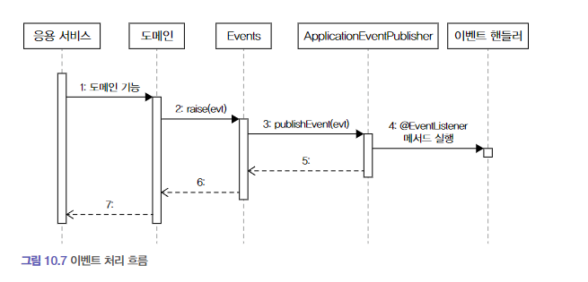
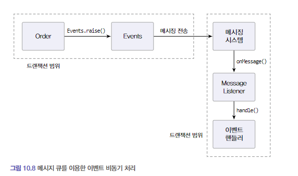
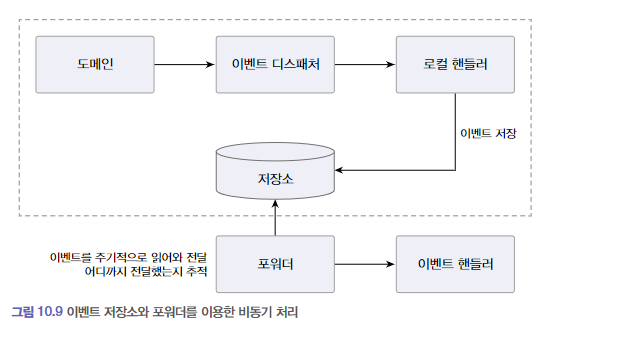
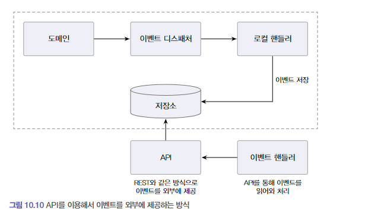

# Chapter 10 - 이벤트

## 10.1 시스템 간 강결합 문제

보통 결제 시스템은 외부에 존재하므로 외부에 있는 결제 시스템이 제공하는 환불 서비스를 호출한다.  

외부 시스템 연동시 문제점 
1. 외부 서비스에 문제가 있는 경우 일관성 보장은?     
2. 성능은? 외부 시스템의 응답이 길어질 경우..
3. 도메인 로직에 다른 도메인이 섞이는 설계상 문제

이런 문제는 바운디드 컨텍스트 간의 강결합 때문이다.

이런 강결합은 이벤트를 통해 없앨수 있다.  
특히 비동기 이벤트를 사용하면 두 시스템 간의 결합을 크게 낮출 수 있다.

## 10.2 이벤트 개요

이 절에서 사용하는 이벤트라는 용어는 '과거에 벌어진 어떤 것' 을 뜻한다.  
이벤트가 발생한다는 것은 상태가 변경됐다는 것을 의미한다.

### 10.2.1 이벤트 관련 구성요소

도메인 모델에 이벤트를 도입하려면 아래와 같은 네 개의 구성요소를 구현해야한다.

- 이벤트
- 이벤트 생성 주체 : 엔티티, 밸류, 도메인 서비스 -> 도메인 로직 실행해서 상태가 바뀌면 관련 이벤트 발생
- 이벤트 디스패처(퍼블리셔) : 이벤트 생성주체와 이벤트 핸들러를 연결해주는 것 (이벤트를 전달받아서 이벤트 핸들러에 전달)
- 이벤트 핸들러(구독자) : 이벤트 생성 주체가 발생한 이벤트에 반응함

### 10.2.2 이벤트의 구성

- 이벤트 종류 : 클래스 이름으로 이벤트 종류 표현
- 이벤트 발생시간
- 추가데이터 : 주문번호, 신규배송지정보 등 이벤트와 관련된 정보

```java
public class ShippingInfoChangedEvent {
    
    private String orderNumber;
    private long timestamp;
    private ShippingInfo newShippingInfo;

    // 생성자, getter
}
```
배송지 변경할 때 발생하는 이벤트를 위한 클래스 (이미 벌어진 것으로 표현하기 때문에 과거 시제)

Events.raise()는 디스패처를 통해 이벤트를 전파하는 기능을 제공한다.
```java
public class ShippingInfoChangedHandler {

    @EventListener(ShippingInfoChangedEvent.class)
    public void handle(ShippingInfoChangedEvent evt) {
        // 이벤트가 필요한 데이터를 담고 있지 않으면,
        // 이벤트 핸들러는 리포지터리, 조회 API, 직접 DB 접근 등의
        // 방식을 통해 필요한 데이터를 조회해야함
        Order order = orderRepository.findById(evt.getOrderNo());
        shippingInfoSynchronizer.sync(evt.getOrderNumber(),
                                      evt.getNewShippingInfo());
    }
}
```
핸들러는 디스패처로부터 이벤트를 전달받아 작업 수행  
변경된 배송지 정보를 물류서비스에 전송하는 핸들러  
데이터가 부족하면 핸들러는 필요한 데이터를 읽기 위해 관련API 호출 혹은 DB를 읽어와야함

### 10.2.3 이벤트 용도

이벤트는 크게 2가지 용도로 쓰인다.

- 트리거  
도메인의 상태가 바뀔때 후처리가 필요할 경우 후처리를 실행하기 위한 트리거로 이벤트를 사용할 수 있다.
- 타 시스템간의 데이터 동기화  
이벤트를 사용하면 서로 다른 도메인 로직이 섞이는 것을 방지할 수 있다.


주문 취소시 환불처리를 위한 트리거 사용

### 10.2.4 이벤트 장점

- 서로 다른 도메인 로직이 섞이는 것을 방지
- 이벤트 핸들러를 사용하면 기능 확장도 용이하다.
- 기능을 확장해도 구매 취소 로직은 수정할 필요가 없다.

## 10.3 이벤트, 핸들러, 디스패처 구현

- 이벤트 클래스: 이벤트를 표현한다.
- 디스패처: 스프링이 제공하는 ApplicationEventPublisher 를 이용한다.
- Events: 이벤트를 발생한다.
- 이벤트 핸들러: 이벤트를 수신해서 처리한다.

### 10.3.1 이벤트 클래스

이벤트 자체를 위한 상위타입은 없음. 원하는 클래스를 이벤트로 사용하면 됨.  
OrderCanceledEvent와 같이 클래스 뒤에 접미사로 Event사용 (과거시제사용)  
이벤트클래스는 이벤트를 처리하는데 필요한 최소한의 데이터를 포함해야 한다.

모든 이벤트가 공통으로 갖는 프로퍼티가 존재한다면 관련 상위 클래스를 만들 수 있음.

### 10.3.2 Events 클래스와 ApplicationEventPublisher

````java
public class Events {
    private static ApplicationEventPublisher publisher;
    static void setPublisher(ApplicationEventPublisher publisher) {
        Events.publisher = publisher;
    }
    public static void raise(Object event) {
        if (publisher != null) {
            publisher.publishEvent(event);
        }
    }
}

@Configuration
public class EventsConfig { 
    @Autowired
    private ApplicationContext applicationContext;
    @Bean
    public InitializingBean eventsInitializer(ApplicationEventPublisher eventPublisher) {
        return () -> Events.setPublisher(eventPublisher);
    }
}
````

Events의 raise()는 ApplicationEventPublisher가 제공하는 publishEvent() 메서드를 이용해 이벤트를 발생시킴  
Events 클래스가 사용할 Application Event Publisher 객체는 setPublisher()메서드를 통해서 전달받음

eventInitializer() 메서드는 InitializingBean 타입 객체를 빈으로 설정  
스프링 빈 객체를 초기화할 때 사용하는 Interface -> 이 기능을 이용해 Events클래스 초기화  
ApplicationContext는 ApplicationEventPublisher를 상속하고 있으므로 Events클래스 초기화시 ApplicationContext를 전달

### 10.3.3 이벤트 발생과 이벤트 핸들러

```java
public class Order {
    public void cancel() {
        verifyNotShipped();
        this.state = OrderState.CANCELED;
        Events.raise(new OrderCanceledEvent(number.getNumber()));
    }
}
```
이벤트를 발생시킬 코드는 Events.raise()를 사용  
구매 취소 로직 수행 후 Events.raise()를 이용해서 관련 이벤트를 발생시킴

```java
@Service
public class OrderCanceledEventHandler {
    private RefundService refundService;

    public OrderCanceledEventHandler(RefundService refundService)  {
        this.refundService = refundService;
    }

    @EventListener(OrderCanceledEvent.class)
    public void handle(OrderCanceledEvent event) {
        refundService.refund(event.getOrderNumber());
    }

}
```
@EventListener 어노테이션을 사용해서 핸들러를 구현한다
ApplicationEventPublisher#publishEvent() 메서드 실행할 때 OrderCanceledEvent타입 객체 전달 ->  
OrderCanceledEvent.class값을 갖는 @EventListener애너테이션을 붙인 메서드를 찾아 실행함.

### 10.3.4 흐름정리



1. 도메인 기능을 실행
2. 도메인 기능은 Events.raise()를 이용해서 이벤트를 발생시킴
3. Events.raise()는 스프링이 제공하는 ApplicationEventPublisher를 이용해 이벤트를 출판
4. ApplicationEventPublisher는 @EventListener(이벤트타입.class) 에너테이션이 붙은 메서드 찾아 실행

## 10.4 동기 이벤트 처리 문제

이벤트로 강결합 문제를 해소했으나 외부서비스에 영향을 받는 문제를 해소해야함  
예) 위에서 주문 취소시 OrderCanceledEvent를 발생시키는데 refundService.fund()가 외부 환불 서비스와 연동하고 환불기능이 느려지면 cancel()메서드도 함께 느려짐  
트랜잭션 롤백시 구매취소도 실패가됨  

그렇다면 해소 방법은?  
1. 외부시스템과 연동 동기처리시 이벤트를 비동기로하거나 
2. 이벤트와 트랜잭션 연계하는 방법이 있다.

## 10.5 비동기 이벤트 처리

이벤트를 비동기로 구현할 수 있는 방법

- 로컬 핸들러를 비동기로 실행하기
- 메세지 큐를 사용하기
- 이벤트 저장소와 이벤트 포워더 사용하기
- 이벤트 저장소와 이벤트 제공 API 사용하기

### 10.5.1 로컬 핸들러 비동기 실행

스프링이 제공하는 @Async 어노테이션을 사용

- @EnableAsync 어노테이션을 사용하여 비동기 기능 활성화
- 이벤트 핸들러 메서드에 @Async 어노테이션을 추가
```java
@EnableAsync
@SpringBootApplication
public class TestApplication {
	public static void main(String[] args) {
		SpringApplication.run(TestApplication.class, args);
	}

}
@Service
public class OrderCanceledEventHandler {
    @Async
    @EventListener(OrderCanceledEvent.class)
    public void handle(OrderCanceledEvent event) {
        refundService.refund(event.getOrderNumber());
    }

}
```
OrderCanceledEvent가 발생하면 handle() 메서드를 별도 스레드를 이용해서 비동기로 실행

### 10.5.2 메시징 시스템을 이용한 비동기 구현
카프카나 래빗MQ와 같은 메시징 시스템을 이용



- 메시지큐는 이벤트를 메시지 리스너에게 전달, 메시지 리스너는 알맞은 이벤트 핸들러를 이용해 이벤트 처리
- 이벤트를 메시지큐에 저장하는 과정, 큐에서 이벤트를 읽어와 처리하는 과정은 별도 스레드나 프로세스로 처리
- 이벤트 발생시키는 도메인기능과 메시지 큐에 이벤트 저장 절차를 한 트랜잭션으로 묶어야함
- 도메인 기능 실행 결과를 DB에 반영하고 이 과정에서 발생한 이벤트를 메시지 큐에 저장하는 것을 같은 트랜잭션 범위에서 실행하려면 글로벌 트랜잭션이 필요함 
- RabbitMQ는 글로벌트랜잭션을 지원, Kafka는 지원하지 않는다.

### 10.5.3 이벤트 저장소를 이용한 비동기 처리

이벤트를 DB에 저장한 후 별도 프로그램을 이용해 이벤트 핸들러에 전달



- 이벤트 발생시 핸들러는 스토리지에 이벤트를 저장
- 포워더는 주기적으로 이벤트를 가져와 이벤트 핸들러를 실행 (별도 스레드)
- 이벤트 저장소로 동일한 DB 사용
- 이벤트 처리가 실패할 경우 다시 저장소에서 이벤트를 읽어와 핸들러를 실행하면 됨



- API방식과 포워더 방식의 차이점은 이벤트 전달 방식에 있음
  - 포워더 방식이 포워더를 이용해 이벤트를 외부에 전달
  - API방식은 외부핸들러가 API서버를 통해 이벤트 목록을 가져감
- 포워더방식은 이벤트 처리 추적 역할이 포워더에 있고 API는 외부 핸들러가 어디까지 처리했는지 기억해야함

## 10.6 이벤트 적용 시 추가 고려 사항

- 이벤트에 발생 주체 정보를 EventEntry에 추가할 것인지 여부
  - 위에서 구현한 EventEntry 는 이벤트 발생 주체가 없다.
  - 따라서 특정 주체가 발생한 이벤트만 조회하는 기능을 구현할 수 없다.
  - 필요할 경우 이벤트에 발생 주체 정보를 추가 해야한다.
- 포워더에서 전송실패를 얼마나 허용할 것인지
  - 특정이벤트에서 계속 전송을 실패하게되면 이 이벤트 때문에 나머지 이벤트를 전송할수 없게된다.
  - 이럴때 실패한 이벤트의 재전송 횟수에 제한을 두어야 한다.
  - 실패 이벤트를 생략하지 않고 실패용 DB 나 메세지 큐에 저장하기도 한다.
- 이벤트 손실
  - 이벤트 저장소를 사용하는 방식은 이벤트 발생과 이벤트 저장을 한 트랜잭션으로 처리하기 떄문에 트랜잭션에 성공하면 이벤트가 저장소에 보관된다는 것을 보장할 수 있다.
  - 반면 로컬 핸들러를 이용해서 이벤트를 비동기로 처리할 경우 이벤트 처리에 실패하면 이벤트를 유실하게 된다.
- 이벤트 순서
  - 이벤트를 발생 순서대로 외부 시스템에 전달해야 할 경우 이벤트 저장소를 사용하는것이 좋다.
  - 이벤트 저장소는 일단 저장소에 이벤트를 발생순서대로 저장하고 그 순서대로 이벤트 목록을 제공하기 떄문이다.
  - 반면 메시징 시스템은 사용 기술에 따라 이벤트 발생 순서와 메시지 전달 순서가 다를수 있다.
- 이벤트 재처리
  - 동일한 이벤트를 다시 처리해야 할때 이벤트를 어떻게 할지 결정해야 한다.
  - 가장 쉬운 방법은 마지막으로 처리한 이벤트 순번을 기억해 두었다가 이미 처리한 순번의 이벤트가 도착하면 해당 이벤트를 처리하지않고 무시하는것이다.
  - 이외에 이벤트 처리를 멱등으로 처리하는 방법도 있다.
- 스프링은 @TransactionalEventListener 어노테이션을 지원함 


### 10.6.1 이벤트 처리와 DB 트랜잭션 고려
```
@TransactionalEventListener(
    classes = OrderCanceledEvent.class,
    phase = TransactionPhase.AFTER_COMMIT
)
public void handle(OrderCanceledEvnet event) {
  refundService.refund(event.getOrderNumbe());
}
```
TransactionPhase.AFTER_COMMIT 의 경우 트랜잭션 커밋에 성공한 뒤에 핸들러 메서드를 실행한다.  
트랜잭션이 성공할 때만 이벤트 핸들러를 실행하게 되면 이제 이벤트 처리 실패만 고민하면 된다.

이벤트 특성에 따라 재처리 방식을 결정하면 된다.