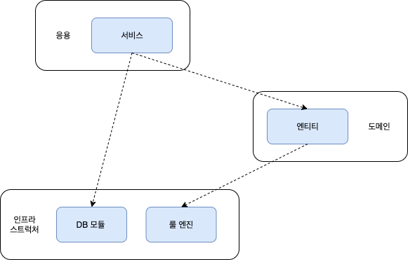
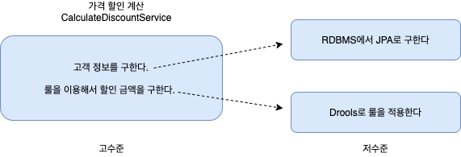
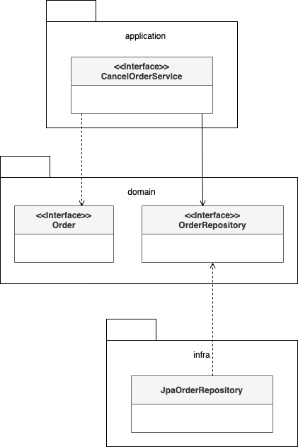
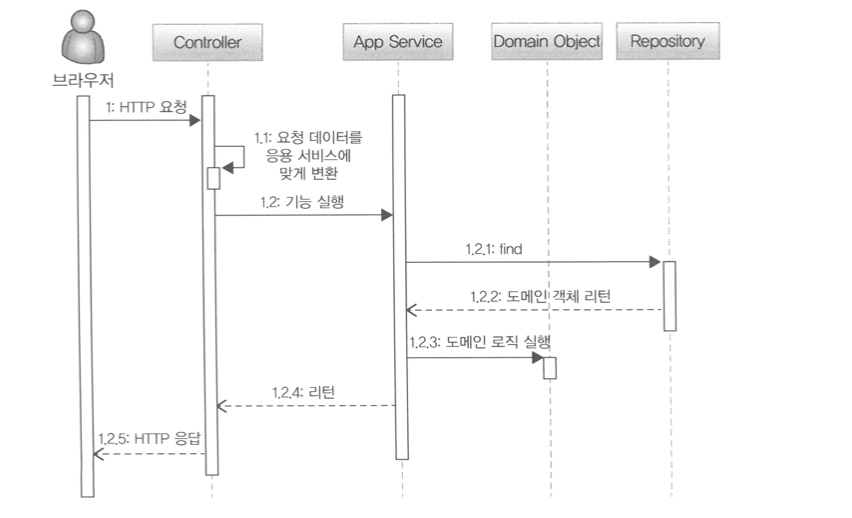

# Chapter 2 - 아키텍처 개요
## 2.1 네 개의 영역

### 표현 영역 ( Presentation )

- 사용자의 요청을 받아 Application 영역에 전달하고 Application 영역의 처리 결과를 다시 사용자에게 보여주는 역할
- 스프링 MVC 프레임워크가 presentation 영역을 위한 기술에 해당
- 웹 어플리케이션에서 Presentation 영역의 사용자는 웹 브라우저를 사용하는 사람 혹은 REST API 를 호출하는 외부 시스템일 수 있다.
- HTTP 요청을 Application 영역이 필요로 하는 형식으로 변환해서 Application 영역에 전달하고, Application 영역의 응답을 HTTP 응답으로 변환해서 전송한다.

### 응용 영역 ( Application )

- 표현 영역을 통해 사용자의 요청을 전달받아 시스템이 사용자에게 제공해야 할 기능을 구현한다.
- 기능을 구현하기 위해 도메인 영역의 도메인 모델을 사용한다.
- 응용 서비스는 로직을 직접 수행하기 보다는 도메인 모델에 로직 수행을 위임한다.


### 도메인 영역 ( Domain )
- 도메인 모델은 도메인의 핵심 로직을 구현한다

### 인프라스트럭처 영역 ( Infrastructure )
- 구현 기술에 대한 것을 다룬다. 이 영역은 RDBMS 연동 처리, 메시징 큐에 메시지를 전송하거나 수신하는 기능을 구현한다
- 논리적인 개념을 표현하기보다는 실제 구현을 다룬다.

## 2.2 계층 구조 아키텍처

Presentation, Application 영역은 Domain 영역을 사용하고, Domain 영역은 Infrastructure 영역을 사용하므로 계층 구조를 적용하기에 적당하다. <br /> 
Domain 복잡도에 따라 Application과 Domain 을 분리하기도 하고 한 계층으로 합치기도 한다. <br />
계층 구조는 그 특성상 상위 계층에서 하위 계층으로서의 의존만 존재하고 하위 계층은 상위 계층에 의존하지 않는다. 



응용 영역과 도메인 영역은 DB나 외부 시스템 연동을 위해 인프라스트럭처의 기능을 사용하므로 이런 계층 구조를 사용하는 것은 직관적으로 이해하기 쉽다. <br/>
하지만, 표현/응용 계층이 상세한 구현 기술을 다루는 인프라스트럭처 계층에 종속될수 있는 위험이 있다.

인프라스트럭처에 의존하면 '테스트 어려움'과 '기능 확장의 어려움'이라는 두 가지 문제가 발생한다.

## 2.3 DIP

DIP = Dependency Inversion Principle 의존 역젼 원칙



CalculateDiscountService는 고수준 모듈이다. 고수준 모듈의 기능을 구현하려면 여러 하위 기능이 필요하다. <br/>
(고객정보 구하기, 할인 금액 계산하기) 저수준 모듈은 하위 기능을 실제로 구현한 것이다.

고수준 모듈이 제대로 동작하려면 저수준 모듈을 사용해야 한다. <br />
그런데 고수준 모듈이 저수준 모듈을 사용하면 앞서 계층 구조 아키텍처에서 언급했던 두 가지 문제가 발생한다.

DIP는 이를 해결하기 위해 저수준 모듈이 고수준 모듈에 의존하도록 바꾼다. 원리는 추상화한 인터페이스에 있다.

```
public interface RuleDiscounter {
    public Money applyRules(Customer customer, List<OrderLine> orderLines);
}
```

CalculateDiscountService가 RuleDiscounter를 이용하도록 변경
```
public class CalculateDiscountService {
	private CustomerRepository customerRepository;
	private RuleDiscounter ruleDiscounter;

	public Money calculateDiscount(OrderLine orderLines, String customerId) {
		Customer customer = customerRepository.findCusotmer(customerId);
		return ruleDiscounter.applyRules(customer, orderLines);
	}
}
```

DroolsRuleEngine 클래스를 RuleDiscounter 인터페이스로 구현체로 변경
```
public class DroolsRuleDiscounter implements RuleDiscounter{
	private KieContainer kContainer;

	@Override
	public void applyRules(Customer customer, List<OrderLine> orderLines) {
		...
	}
}
```

CalculateDiscountService는 '룰을 이용한 할인 금액 계산'을 추상화한 RuleDiscounter 인터페이스에 의존할 뿐이다.<br />
DroolsRuleDiscounter는 고수준의 하위 기능인 RuleDiscounter를 구현한 것이므로 저수준 모듈에 속한다.

CalculateDiscountService가 제대로 동작하는지 테스트하려면 CustomerRepository와 RuleDiscounter를 구현한 객체가 필요하다. <br />
만약 CalculateDiscountService가 저수준 모듈에 직접 의존했다면 저수준 모듈이 만들어지기 전까지 테스트를 할 수가 없었겠지만<br/>
CustomerRepository와 RuleDiscounter는 인터페이스이므로 대용 객체(Mock)를 사용해서 테스트를 진행할 수 있다


### DIP 주의사항
DIP는 단순히 인터페이스와 구현 클래스를 분리하기 위함이 아니라 고수준 모듈이 저수준 모듈에 의존하지 않도록 하기 위함이다.

DIP를 적용할 때 하위 기능을 추상화한 인터페이스는 고수준 모듈 관점에서 도출한다.

### DIP 와 아키텍처

인프라스트럭처 영역은 구현 기술을 다루는 저수준 모듈이고 응용 역영과 도메인 영역은 고수준 모듈이다.

인프라스트럭처 계층의 가장 하단에 위치하는 계층형 구조와 달리 아키텍처에 DIP를 적용하면 인프라스트럭처 영역이 응용 영역과 도메인 영역에 의존(상속)하는 구조가 된다.


## 2.4 도메인 영역의 주요 구성요소

### 주요 구성요소

| 요소      | 설명                                                                                 |
|---------|------------------------------------------------------------------------------------|
| 엔티티     | 고유식별자를 갖는 객체로 자신의 라이프 사이클을 갖는다. <br /> 고유한 개념을 포함하며 도메인 모델의 데이터를 포함하고 관련 기능을 함께 제공 |
| 밸류      | 고유 식별자를 갖지 않는 객체. 개념적으로 하나의 값을 표현할 때 사용 <br /> 엔티티나 다른 밸류 타입의 속성으로 사용              |
| 애그리거트   | 연관된 엔티티와 밸류 객체를 개념적으로 하나로 묶은 것                                                     |
| 레포지터리   | 도메인 모델의 영속성을 처리. DB 테이블에서 로딩하거나 저장하는 기능                                            |
| 도메인 서비스 | 엔티티에 속하지 않은 도메인 로직을 제공                                                             |

### 2.4.1 엔티티와 밸류

도메인 모델 엔티티 != DB 테이블 엔티티

1. 도메인 모델의 엔티티는 데이터와 홤께 도메인 기능을 함께 제공한다. <br />
즉 단순히 데이터를 담고 있는 데이터 구조가 아니라 기능을 함께 제공하는 객체다.

2. 두 개 이상의 데이터가 개념적으로 하나인 경우 밸류 타입을 이용한 표현이 가능.

### 2.4.2 애그리거트

애그리거트란? 관련 객체를 하나로 묶은 군집.

도메인 규모가 커질수록 모델은 점점 더 복잡해지며 개발자는 전체 구조가 아닌 한 개의 엔티티와 밸류에만 집중하는 상황이 발생한다.<br />
개별 객체 뿐만 아니라 상위 수준에서 모델을 볼 수 있어야 전체 모델의 관계와 개별 모델을 이해하는데 도움이 된다. <br />
도메인 모델에서 전체 구조를 이해하는데 도움이 되는 것이 **애그리거트**다. 

애그리거트는 군집에 속한 객체를 관리하는 루트 엔티티를 갖는다. 

### 2.4.3 리포지터리

리포지터리란? 물리 저장소에 도메인 객체를 보관하기 위한 도메인 모델. 구현을 위한 모델.

도메인 모델 관점에서 OrderRepository는 도메인 객체를 영속화하는 데 필요한 기능을 추상화한 것으로 고수준 모듈에 속한다. <br />
기반 기술을 이용해서 OrderRepository는를 구현한 클래스는 저수준 모듈로 인프라스트럭처 영역에 속한다.



서비스에서 리포지토리를 접근하는 이유
- 응용서비스는 피룡한 도메인 객체를 구하거나 저장할 때 리포지터리를 사용한다.
- 응용서비스는 트랜잭션을 관리하는데, 트랜잭션 처리는 리포지터리 구현 기술의 영향을 받는다.

## 2.5 요청 처리 흐름



1. 표현영역 : 사용자가 전송한 데이터 형식이 올바른지 검사 후 변환해서 서비스로 전달
2. 응용서비스 : 도메인 모델을 이용해서 기능 구현. 기능 동작 후 결과를 리턴한다.
3. 리포지토리 : 서비스에게 요청받은 도메인 객체를 전달하거나 저장한다
4. 도메인객체 : 도메인 로직을 실행한다.

## 2.6 인프라스트럭쳐 개요

- 인프라스트럭처는 표현 영역, 응용 영역, 도메인 영역을 지원한다.
- 도메인 객체의 영속성 처리, 트랜잭션, SMTP 클라이언트, REST 클라이언트 등 다른 영역에서 필요로 하는 프레임워크, 구현 기술, 보조 기능을 지원한다.
- 도메인 영역과 응용 영역에 정의한 인터페이스를 인프라스트럭처 영역에서 구현하는 것이 시스템을 더 유연하고 테스트하기 쉽게 만들어준다.
  (무조건 의존을 없앨 필요는 없다. 상황에 따라 구현을 더 복잡하고 어렵게 만들 수도 있다.)


## 2.7 모듈 구성

- 패키지 구성 규칙에 한 개의 정답만 존재하는 것은 아니지만 영역별로 모듈이 위치할 때 패키지를 구성할 수 있다.
- 도메인이 크다면 하위 도메인으로 나누고 각 하위 도메인마다 별도 패키지를 구성하게 할 수 있다.
- 도메인 모듈은 도메인에 속한 애그리거트를 기준으로 다시 패키지를 구성한다.
- 모듈 구조를 얼마나 세분화 할지에 대해서는 정해진 규칙은 없다.
- 한 패키지에 너무 많은 타입이 몰려서 코드를 찾을 때 불편한 정도만 아니면 된다.