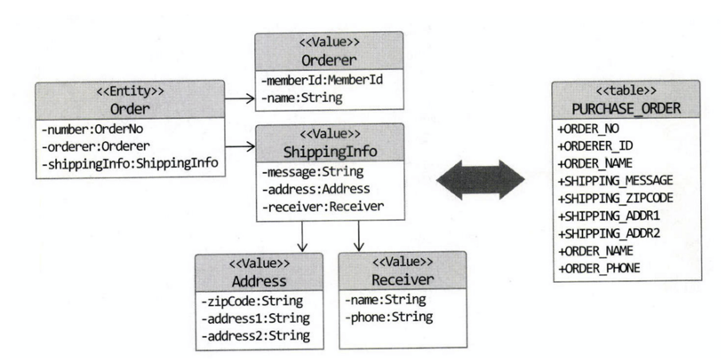

# Chapter 4 - 리포지터리와 모델 구현

## 4.1 JPA 를 이용한 리포지터리 구현

### 4.1.1 모듈 위치

리포지터리 인터페이스 --> 도메인 영역  
리포지터리 구현 클래스(ex. JpaModelRepository) --> 인프라 영역

리포지터리 구현 클래스를 인프라스트럭처 영역에 위치 시켜서 인프라스트럭처에 대한 의존을 낮춰야 한다. (DIP)

### 4.1.2 리포지터리 기본 기능 구현

리포지터리 기본 기능
* ID로 애그리거트 조회하기
* 애그리거트 저장하기

````java
public interface OrderRepository {
    Order findById(OrderNo no);
    void save(Order order);
}
````

인터페이스는 애그리거트 루트를 기준으로 작성한다.  
스프링과 JPA로 구현한다면 리포지터리 구현 클래스는 스프링 데이터 JPA 가 알아서 만들어준다.  
애그리거트를 수정한 결과도 JPA 를 사용하면 트랜잭션 범웨에서 변경한 데이터를 자동으로 DB에 반영하기 때문에 메서드를 별도 추가할 필요 없다.

@Transaction 어노테이션을 단 서비스 레이어의 메서드를 실행한 결과로 애그리거트가 변경되면 JPA 는 자동으로 Update 쿼리를 실행한다.

ID가 아닌 다른 조건으로 애그리거트를 조회할 때는 findBy 뒤에 해당 프로퍼티명을 붙인다.

````java
public interface OrderRepository {
    List<Order> findByUserId(String userId, int startRow, int size);
    void save(Order order);
}
````

ID 외의 조건으로 조회할 경우 JPA의 Criteria OR JPQL 을 사용 가능하다.

JPQL 이란?  
- JPQL 은 SQL 이 아니라 객체 지향 쿼리 언어이다. 테이블을 대상으로 조회하는것이 아니다.
- JPQL 은 특정 데이터베이스에 의존하지 않는다.
- JPQL 은 결국 SQL 로 변환된다.

Criteria 란?  
- Criteria 는 JPQL 의 작성을 도와주는 빌더 클래스이다. 
- 문자열로 JPQL 을 작성하면 런타임이 되어야 문법 오류를 알 수 있지만 Criteria 는 자바 코드 기반이기 때문에 안전하게 JPQL 을 작성할 수 있다.


## 4.2 스프링 데이터 JPA 를 이용한 리포지터리 구현

스프링 데이터 JPA 는 지정한 규칙에 맞게 리포지터리 인터페이스를 정의하면 리로지터리를 구현한 객체를 자동으로 만들어 스프링 빈으로 등록해 준다.

## 4.3 맵핑 구현

### 4.3.1 엔티티와 밸류 기본 맵핑 구현

* 애그리거트 루트는 엔티티이므로 @Entity 로 매핑 설정한다.
* 밸류는 @Embeddable 로 맵핑 한다.
* 밸류 타입 프로퍼티는 @Embedded 로 맵핑한다.



위 그림처럼 한 테이블로 맵핑 가능한 애그리거트는 Entity 와 Value 로 구성되어 있으며, Value는 @Embeddable 로 매핑한다.

### 4.3.2 기본 생성자

불변 타입이면 생성시점에 필요한 값을 모두 갖고 set 메서드를 제공하지 않는다.  
이는 파라미터가 없는 기본 생성자를 추가할 필요가 없다는 것과 같지만, JPA에서 @Entity와 @Embeaddable 로 매핑하려면 기본 생성자를 제공해야 한다.  
이유? DB에서 데이터를 들고 온 다음 매핑된 객체를 생성하기 위해 기본 생성자를 사용해서 비어있는 기본객체를 생성해야 하기 때문.  
다른 코드에서는 해당 기본생성자를 사용못하도록 protected 로 선언한다.

### 4.3.3 필드 접근 방식 사용

public getter setter 를 사용하면 도메인의 의도가 사라지고 객체기반이 아닌 데이터기반으로 엔티티를 구현할 가능성이 높아진다.  
* setter는 캡슐화에 위반
* setState() -> cancel() : 의도가 드러다는 기능 or 메시지로 표현

### 4.3.4 AttributeConverter 를 이용한 밸류 매핑 처리

AttributeConverter : 두 개 이상의 밸류 타입을 한 개 컬럼에 매핑하기 위해 사용.

````java
@Entity
@Table(name = "purchase_order")
public class Order {
    @Column(name = "total_amounts")
    private Money totalAmounts; // MoneyConverter 를 적용해서 값 변환
}
````

### 4.3.5 밸류 컬렉션: 별도 테이블 매핑

밸류 컬렉션을 별도 테이블로 매핑할 때는 @ElementCollection 과 @CollectionTable 을 함께 사용한다.

````java
@Entity
@Table(name = "purchase_order")
public class Order {
    // ...
    @ElementCollection
    @CollectionTable(name = "order_line", joinColumns = @JoinColumn(name = "order_number"))
    @OrderColumn(name = "line_idx")
    private list<OrderLine> orderLines;
}

@Embeddable
public class OrderLine {
    // ...
    @Embedded
    private ProductId productId;
}
````
### 4.3.6 밸류 컬랙션: 한개 컬럼 매핑

ex) 이메일 주소 목록 : [a@a.net, b@b.com, ...] 

이때에도 AttributeConverter 를 사용하면 된다.  
단, AttributeConverter 를 사용하려면 밸류 컬렉션을 표현하는 새로운 밸류 타입을 추가해야 한다.

````java
public class EmailSet {
  private Set<Email> emails = new HashSet<>();

  public EmailSet(Set<Email> emails) {
    this.emails.addAll(emails);
  }

  public Set<Email> getEmails() {
    return Collections.unmodifiableSet(emails);
  }

}
````
````java
@Converter
public class EmailSetConverter implements AttributeConveter<EmailSet, String> {

  @Override
  public String convertToDatabaseColumn(EmailSet attribute) {
    if (attribute == null) {
      return null;
    }
    return attribute.getEmails().stream()
        .map(Email::toString)
        .collect(Collectors.joining(","));
  }

  @Override
  public EmailSet convertToEntityAttribute(String dbData) {
    if (dbData == null) {
      return null;
    }
    String[] emails = dbData.split(",");
    Set<Email> emailSet = Arrays.stream(emails)
        .map(value -> new Email(value))
        .collect(toSet());
    return new EmailSet(emailSet);
  }
}

````

````
@Column(name = "emails")
@Convert(converter = EmailSetConverter.class)
private EmailSet emailSet;
````

### 4.3.7 밸류를 이용한 ID 매핑

식별자라는 의미를 부각시키기 위해 식별자 자체를 밸류 타입을 만들 수도 있다.  
밸류 타입을 식별자로 매피앟면 @Id 대신 @EmbeddedId 애너태이션을 사용한다.

밸류 타입으로 식별자를 구현 할 경우 식별자에 기능을 추가할수 있다.

JPA 에서 식별자 타입은 Serializable 타입이어야 한다.
내부적으로 엔티티를 비교시 사용하는 equals() 와 hashcode() 메서드도 알맞게 구현해야한다.

### 4.3.8 별도 테이블에 저장하는 밸류 매핑

밸류인지 엔티티인지 구분하는 방법은 고유 식별자를 갖는지 확인 하는것이다.   
하지만 별도 테이블에 PK 가 있다고해서 테이블과 매핑되는 애그리거트가 항상
고유 식별자를 갖는것은 아니다.  
단순 매핑을 위한 테이블인 경우 특정 프로퍼티를 별도 테이블에 보관한 것으로 접근해야한다.

이때 밸류를 매핑한 테이블을 지정하기 위해 @SecondaryTable 과 @AttributeOverride 를 사용한다.

@SecondaryTable 을 이용하면 아래 코드를 실행할 때 두 테이블을 조인해서 데이터를 조회한다.


### 4.3.9 밸류 컬렉션을 @Entity 로 매핑하기

개념적으로는 밸류지만 기술문제 or 팀표준 때문에 @Entity를 사용할 때도 있다고 한다.  
상속 구조를 갖는 밸류 타입을 사용하는 경우 JPA는 @Embeddable 타입의 클래스 상속 매핑을 지원하지 않기 때문에 @Entity 를 이용한 상속 매핑으로 처리해야 한다.

밸류는 독자적인 라이프 사이클을 갖지 않고 앤티티로 관리 되므로 cascade 와 orphanRemoval 를 지정한다.  
컬렉션에 clear() 를 사용할 경우 다수의 delete 쿼리가 발생하므로 성능상 좋지 않을 수 있다.

이방식을 사용하지 않고 @Embeddable 매핑 단일 클래스를 사용할 경우 상속을 포기하고 if-else 로 column 을 구분해야한다.

### 4.3.10 ID 참조와 조인 테이블을 이용한 단방향 M-N 매핑

애그리거트 간 집합 연관은 성능 문제로 가능한한 피해야하지만 해야한다면 ID 참조를 이용한 단방향 집합 연관을 적용한다.  

집합의 값에 밸류 대신 연관을 맺는 식별자를 사용하며, @ElementCollection 을 이용하기 때문에 Product 를 삭제할 때 매핑에 사용한 조인 테이블의 데이터도 함께 삭제된다.

## 4.4 애그리거트 로딩 전략

JPA 매핑을 설정할때 중요한점은 애그리거트의 속한 객체가 모두 모여야 완전한 하나가 되어야 한다.  
완전해야 하는 이유는? 
1. 상태 변경 시 애그리거트 상태가 완전해야함
2. 표현 영역에서 애그리거트의 상태 정보를 보여줄 때 필요

조회할때 완전한 상태가 되려면? 즉시로딩(Eager Loading)하면 된다.  
하지만 조회되는 데이터가 많이자면 즉시로딩은 성능면에서 문제가 될 수 있다.

상태 변경 기능을 위해 즉시 로딩을 이용해서 완전한 상태로 로딩할 필요 없다.  
지연 로딩으로 필요한 구성요소만 로딩해도 문제 없다.

지연로딩, 즉시로딩은 장다점이 있으므로 애그리거트에 맞게 적절하게 선택해서 사용해야 한다.

## 4.5 애그리거트의 영속성 전파

저장 혹은 삭제할 때도 애그리거트가 완전한 상태로 해야 한다.
* 저장 메서드는 애그리거트 루트만 저장하면 안 되고 애그리거트에 속한 모든 객체를 저장해야 한다
* 삭제 메서드는 애그리거트 루트뿐만 아니라 애그리거트에 속한 모든 객체를 삭제 해야 한다.

@Embeddable 매핑 타입의 경우 함께 저장되고 삭제되므로 cascade 속성을
추가로 설정하지 않아도 된다.

반면에 애그리거트에 속한 @Entity 타입에 대한 매핑은 cascade 속성을
사용해서 저장과 삭제 시에 함께 처리되도록 설정해야 한다.

## 4.6 식별자 생성기능

식별자는 크게 세가지 방식으로 생성한다.

* 사용자가 직접 생성
* 도메인 로직으로 생성
* DB 를 이용한 일련번호 사용

식별자 생성 규칙이 있다는 경우
* 별도 서비스로 도메인 영역에 식별자 생성 기능을 추가하거나, 
* 리포지터리 인터페이스에 식별자 생성 메서드를 추가 후 구현 클래스에서 구현한다.

DB 자동증가 컬럼을 식별자로 사용할 경우 @GeneratedValue 를 사용.

## 4.7 도메인 구현과 DIP

DIP 에 따르면 이는 구현 기술에 속하므로 도메인 모델이 구현 기술인 JPA 에 의존하면 안된다.  
Repository 의 경우 스프링 데이터 JPA 의 Repository 인터페이스를 상속하고 있으므로 이는 도메인이 인프라에 의존하는 것이다.

DIP 를 적용하는 이유는 저수준 구현이 변경되어도 고수준이 영향 받지 않도록 하기 위함이다.  
하지만  리포지터리 구현 기술은 변경이 거의 없기 때문에 DIP 적용하는 것은 과한 처리다.

DIP 를 완벽히 지키면 좋겠지만 편의성, 실용성, 복잡도를 고려해서 합리적인 개발 구조를 고려해야 한다.

