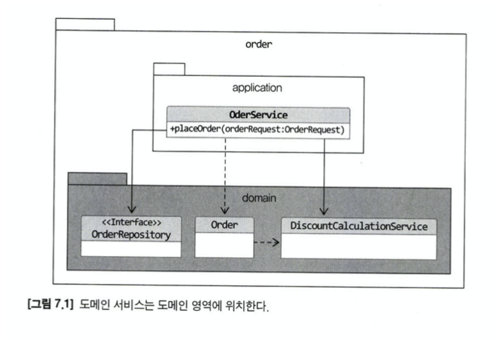
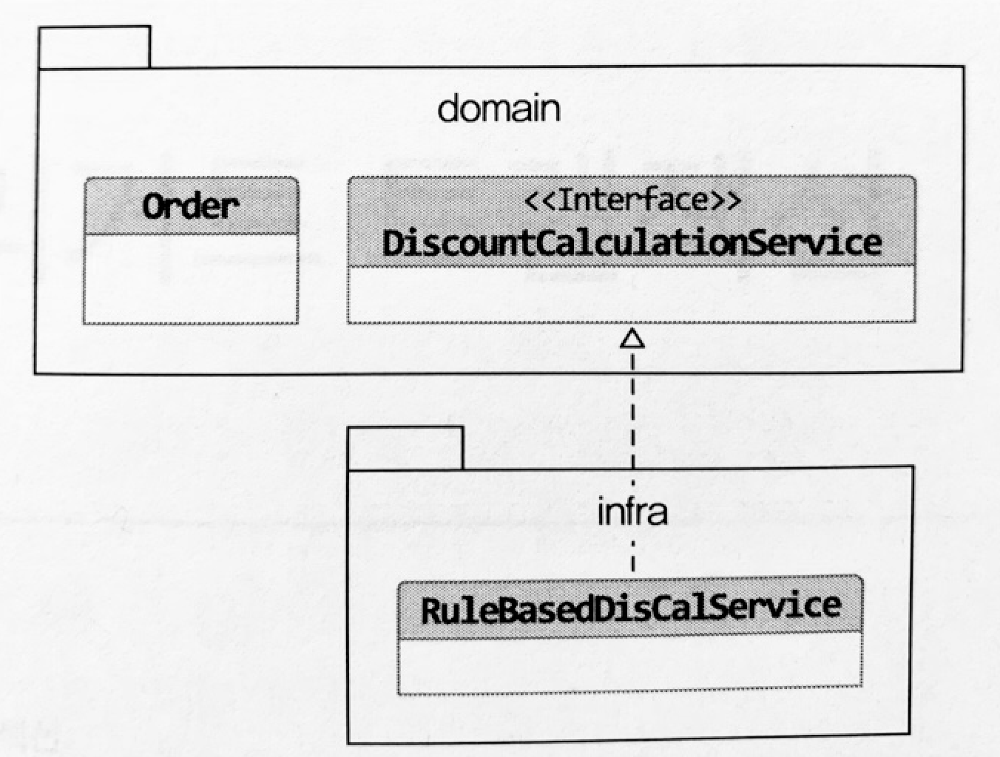

# Chapter 7 - 도메인 서비스

## 7.1 여러 애그리거트가 필요한 기능

하나의 서비스에서 여러 애그리거트가 필요한 경우  
ex) 결제 금액 계산의 경우 상품(가격), 주문(개수), 쿠폰(할인률), 회원(등급별 할인) 등의 도메인이 필요하다. 

이런 경우 계산 책임을 어디로 줘야할까?

주문 애그리거트에 할당 한다면?  
주문 로직안에 할인 정책 등이 들어가야 하고, 할인 정책이 변경되면 관련 없는 주문 애그리거트까지 코드 수정이 필요해진다.  
즉, 억지로 특정 애그리거트에 구현하면 책임 밖의 기능을 구현하기 때문에 코드가 납잡해지고 외부의존성이 높아진다.

이러한 문제를 해결하기 위해 있는 것이 도메인 서비스다.

## 7.2 도메인 서비스

도메인서비스는 도메인 영역에 위치한 로직을 표현할 때 사용되며 주로 계산로직이나 외부 시스템 연동하는 경우 사용된다.

### 7.2.1 계산로직과 도메인 서비스 

계산 로직같이 하나의 애그리거트에 넣기 애매하다면 도메인 서비스를 이용해서 도메인 개념을 명시적으로 드러내자.  

도메인 서비스가 도메인 영역의 애그리거트나 밸류와 같은 다른 구성요소와 비교할 때 다른 점이 있다면 상태 없이 로직만 구현한다는 점이다.  
````java
public class DiscountCalculationService {

  public Money calculateDiscountAmounts(
      List<OrderLIne> orderLines,
      List<Coupon> coupons,
      MemberGrade grade) {
    Money couponDiscount = coupons.stream()
        .map(coupon -> calculateDiscount(coupon))
        .reduce(Money(0), (v1, v2) -> v1.add(v2));

    Money membershipDiscount = calculateDiscount(orderer.getMember().getGrade());

    return couponDiscount.add(membershipDiscount);
  }
  // ...
}
````
할인 계산 서비스를 사용하는 주체는 애그리거트가 될 수도 있고 응용 서비스가 될수도 있다.
애그리거트의 결제 금액 계산기능에 전달하면 사용 주체는 애그리거트가 된다.  
애그리거트 객체에 도메인 서비스를 전달하는 것은 응용 서비스 책임이다.

도메인 서비스 객체를 애그리거트에 주입하지 않아야 한다.  
도메인 서비스는 도메인 로직만 수행하고 응용 로직은 수행하지는 않는다.  
트랜잭션 처리와 같은 로직은 응용 로직이므로 도메인 서비스가 아닌 응용 서비스에서 처리해야 한다.

### 7.2.2 외부 시스템 연동과 도메인 서비스

예를 들어 설문 조사 시스템에서 설문을 생성할때 사용자가 권한이 있는지 외부 시스템과 연동하여 확인을 해야한다고 할때  
타 도메인과의 연동 기능의 도메인 서비스를 인터페이스로 구현한다.

````java
public class CreateSurveyService {
  private SurveyPermissionChecker surveyPermissionChecker;
  
  public Long createSurvey(CreateSurveyRequest req) {
    validate(req);
    // 도메인 서비스를 이용해서 외부 시스템 연동을 표현
    if (!surveyPermissionChecker.hasUserCreationPermission(req.getRequestorId())) {
      throw new NoPermissionException();
    }
  }
}
````
SurveyPermissionChecker 인터페이스의 구현체는 인프라 영역에 위치해 연동을 포함한 권한 검사 기능을 구현한다.

### 7.2.3 도메인 서비스의 패키지 위치

도메인 서비스는 도메인 로직을 표현하므로 다른 도메인 구성요소와 동일한 패키지에 위치한다.


도메인 서비스 개수가 많거나 다른 구성요소와 명시적으로 구분하고 싶을 경우 domain.model, domain.service, domain.repository 처럼 domain 패키지 밑에 구분해도 된다.


### 7.2.4 도메인 서비스의 인터페이스와 클래스

도메인 서비스의 로직이 고정되어 있지 않은 경우 도메인 서비스 자체를 인터페이스로 구현하고 이를 구현한 클래스를 둘 수도 있다.  

도메인 서비스는 도메인 영역에 구현체는 인프라 영역에 위치한다.  
도메인 로직을 외부 시스템이나 별도 엔진을 이용해 구현해야 할 경우 인터페이스와 클래스를 분리하게 된다.  
예를 들어, 할인 금액 계산 로직을 룰 엔진을 이용해 구현한다면 아래 그림처럼 도메인 영역에는 도메인 서비스 인터페이스가 위치하고 실제 구현은 인프라스트럭처 영역에 위치시킬 수 있다.



특정 기술or 외부API에 의존한다면 도메인 영역이 특정 구현에 종속되는 것을 방지하고 테스트코드 작성하기 쉽도록 도메인 서비스를 인터페이스로 추상화 해야한다.
