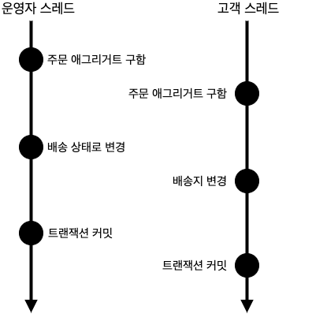
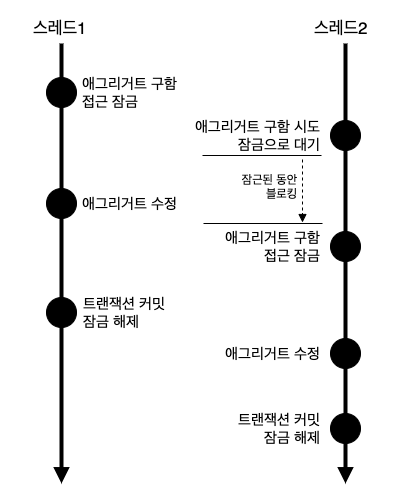

# Chapter 8 - 애그리거트 트랜잭션 관리

## 8.1 애그리거트와 트랜잭션

 

한 애그리거트를 두 사용자가 거의 동시에 변경할 때 트랜잭션이 필요하다.  
위 예시는 두 스레드는 각각 트랜잭션을 커밋할 때 수정한 내용을 DBMS에 반영해서 애그리거트의 일관성이 깨질수 있는 상황이다.

**문제 해결 방법**
1. 선점 잠금 방식(비관적 잠금)
   운영자가 배송지 정보를 조회하고 상태를 변경하는 동안 고객이 애그리거트를 수정하지 못하게 막는다.
2. 비선점 잠금 방식(낙관적 잠금)
   운영자가 배송지 정보를 조회한 이후에 고객이 정보를 변경하면 운영자가 애그리거트를 다시 조회한 뒤 수정하도록 한다.

## 8.2 선점 잠금

먼저 애그리거트를 구한 스레드가 애그리거트 사용이 끝날 때까지 다른 스레드가 해당 애그리거트를 수정하는 것을 막는 방식  



스레드1이 선점 잠금 방식으로 애그리거트를 구한 뒤 이어서 스레드2가 같은 애그리거트를 구하고 있다.  
이 경우 스레드2는 스레드1이 애그리거트에 대한 잠금을 해제할 때까지 블로킹된다.

JPA의 EntityManager는 LockModeType을 인자로 받는 find() 메서드를 제공하는다.
```
Order order = entityManager.find(Order.class, orderNo, LockModeType.PESSIMISTIC_WRITE);
```
하이버네이트의 경우 `PESSIMISTIC_WRITE`를 잠금 모드로 사용하면 `for update` 쿼리를 사용해서 선점 잠금을 구현한다.  
`for update`와 같은 쿼리를 사용해서 특정 레코드에 한 사용자만 접근할 수 있는 잠금 장치를 제공한다.

### 8.2.1 선점 잠금과 교착상태

선점 잠금 기능을 사용할 때는 잠금 순서에 따른 교착 상태<sup>deadlock</sup>가 발생하지 않도록 주의해야한다.

1. 스레드1 : A 애그리거트에 대한 선점 잠금 구함
2. 스레드2 : B 애그리거트에 대한 선점 잠금 구함
3. 스레드1 : B 애그리거트에 대한 선점 잠금 시도
4. 스레드2 : A 애그리거트에 대한 선점 잠금 시도

--> 서로 자신의 자원을 못놓고 상대의 자원을 요청하는 상황

선점 잠금에 따른 교착 상태는 상대적으로 사용자 수가 많을 때 발생할 가능성이 높고, 사용자 수가 많아지면 교착 상태에 빠지는 스레드가 더 빠르게 증가하게 된다.  
이런 문제가 발생하지 않도록 하려면 잠금을 구할 때 최대 대시 시간을 지정해야 한다.  
JPA에서 선점 잠금을 시도할 때 최대 대기 시간을 지정하려면 다음과 같이 힌트를 사용하면 된다.

```
Map<String, Object> hints = new HashMap<>();
hints.put("javax.persistence.lock.timeout", 2000);
Order order = entityManager.find( Order.class, orderNo,	LockModeType.PRESSIMISTIC_WRITE, hints);
```

## 8.3 비선점 잠금


선점 잠금으로 해결할 수 없는 케이스
1. 운영자는 배송을 위해 주문 정보를 조회한다. 시스템은 정보를 제공한다.
2. 고객이 배송지 변경을 위해 변경 폼을 요청한다. 시스템은 변경 폼을 제공한다.
3. 고객이 새로운 배송지를 입력하고 폼을 전송해서 배송지를 변경한다.
4. 운영자가 1번에서 조회한 주문 정보를 기준으로 배송지를 정하고 배송 상태 변경을 요청한다.

선점잠금으로 하는 경우 배송 상태 변경 전에 배송지를 한 번 더 확인하지 않으면 운영자는 다른 배송지로 물건을 발송하게 된다.  
비선점 잠금 방식으로 하면 해결된다.

비선점잠금 방식 : 변경한 데이터를 실제 DBMS에 반영하는 시점에 변경 가능 여부 확인
- 비선점 잠금을 구현하려면 애그리거트에 버전으로 사용할 숫자 타입의 프로퍼티를 추가해야 한다.
- 애그리거트를 수정할 때마다 버전으로 사용할 프로퍼티의 값이 1씩 증가하는데, 이 때 다음과 같은 쿼리를 사용한다.

```roomsql
UPDATE aggtable SET version = version + 1, colx = ?, coly = ?
WHERE aggid = ? and version = '현재 버젼'
```

이 쿼리는 수정할 애그리거트와 매핑되는 테이블의 버전 값이 현재 애그리거트의 버전과 동일한 경우에만 데이터를 수정한다.  
그리고 수정에 성공하면 버전 값을 1 증가시킨다.  
따라서 다른 트랜잭션이 먼저 데이터를 수정해서 버전 값이 바뀌면 데이터 수정에 실패하게 된다.

JPA는 버전을 이용한 비선점 잠금 기능을 지원한다.  
아래와 같이 버전으로 사용할 필드에 @Version 어노테이션을 붙이고 매핑되는 테이블에 버전을 저장할 컬럼을 추가하기만 하면 된다.

```java
@Entity
@Table(name = "purchase_order")
@Access(AccessType.FIELD)
public class Order {
   @EmbeddedId
   private OrderNo number;

   @Version
   private long version;
}
```

JPA는 엔티티가 변경되어 UPDATE 쿼리를 실행할 때 @Version에 명시한 필드를 이용해서 비선점 잠금 쿼리를 실행한다.  
```
UPDATE purchage_order SET ...(생략), version = version + 1 WHERE number = ? and version = 10
```

@Transactional을 이용해서 트랜잭션 범위를 정한 후 충돌이 발생하면 OptimisticLockingFailureException이 발생한다.  
- 다른 하나는 응용 서비스 코드에서 발생시키는 VersionConflictException은 이미 누군가가 애그리거트를 수정했다는 것을 의미한다.

에러가 발생한 경우 사용자에게 수정할 수 없다는 에러를 응답으로 전송하여 처리하거나,  
Version을 통해 비교하여 사용하는 경우 버전 충돌을 사용자에게 알려주고 사용자가 알맞는 후속 처리를 할 수 있도록 한다.

### 8.3.1 강제 버전 증가

애그리거트에 애그리거트 루트 외에 다른 엔티티가 존재하는데 기능 실행 도중 루트가 아닌 다른 엔티티의 값만 변경된다고 하자.  
이 경우 JPA는 루트 엔티티의 버전 값을 증가시키지 않는다.
문제는 루트 엔티티의 값이 바뀌지 않았더라도 애그리거트의 구성요소 중 일부 값이 바뀌면 논리적으로 그 애그리거트는 바뀐 것이므로 싱크가 맞지 않게 된다.  
따라서 애그리거트 내에 어떤 구성요소의 상태가 바뀌면 루트 애그리거트의 버전 값을 증가해야 비선점 잠금이 올바르게 동작한다.

JPA는 이런 문제를 처리할 수 있도로 EntityManager.find() 메서드로 엔티티를 구할때 강제로 버전 값을 증가시키는 잠금 모드를 지원하고 있다.

```java
@Repository
public class JpaOrderRepository implements OrderRepository {
   @PersistenceContext
   private EntityMangager entityManager;

   @Override
   public Order findbyIdOptimisticLockMode(OrderNo id) {
      return entityManager.find(Order.class, id, LockModeType.OPTIMISTTIC_FORCE_INCREMENT);
   }
}
```

## 8.4 오프라인 선점 잠금

컨플루언스에서 두 사용자가 같이 편집하는 케이스는 오프라인 선점 잠금<sup>Offline Pessimistic Lock</sup> 방식을 사용한다고 한다.  
-> 검색해본 바로는 공동편집은 "Optimistic Concurrency Control" (낙관적 동시성 제어) 로 스냅샷격리 방식을 사용한다고 하는데 책의 내용은 수정 후 출판의 기능을 말하는 듯 하다.  
참고 : https://cwiki.apache.org/confluence/display/HUDI/RFC+-+22+%3A+Snapshot+Isolation+using+Optimistic+Concurrency+Control+for+multi-writers

오프라인 선점 잠금은 여러 트랜잭션에 걸쳐 동시 변경을 막는다. 잠금을 해제하기 전까지 다른 사용자는 잠금을 구할 수 없다.  


오프라인 선점 방식은 잠금의 유효 시간을 가져야 한다.  
유효 시간이 지나면 자동으로 잠금을 해제해서 다른 사용자가 잠금을 일정 시간 후에 다시 구할 수 있도록 해야 한다.

### 8.4.1 오프라인 선점 잠금을 위한 LockManager 인터페이스와 관련 클래스

오프라인 선점 잠금은 크게 4가지 기능을 제공해야 하며 이를 위해 LockManager 인터페이스가 있다.

```java
public interface LockManager {
   LockId tryLock(String type, String id) throws LockException; // 잠금 선점 시도 
   void checkLock(LockId lockId) throws LockException; // 잠금 확인
   void releaseLock(LockId lockId) throws LockException; // 잠금 해제
   void extendLockExpiration(LockId lockId, long inc) throws LockException; // 락 유효시간 연장
      
}
```

- 잠금 유효 시간이 지났으면 다른 사용자가 잠금을 선점
- 잠금을 선점하지 않은 사용자가 기능을 실행하면 기능 실행을 막음

### 8.4.2 DB를 이용한 LockManager 구현

잠금 정보를 저장하기 위한 별도의 테이블을 생성하여 관리한다.
```
CREATE TABLE LOCKS (
    `type` varchar(255),
    id varchar(255),
    lockid varchar(255),
    expiration_time datetime,
    primary key (`type`, id)
) character set utf8;

create unique index locks_idx ON locks (lockid);
```

locks 테이블의 데이터를 담을 LockData 클래스 예제
```java
public class LockData {
    private String type;
    private String id;
    private String lockId;
    private long expirationTime;
    
    public LockData(String type, String id, String lockId, long expirationTime) {
        this.type = type;
        this.id = id;
        this.lockId = lockId;
        this.expirationTime = expirationTime;
    }    
    //..
}
```