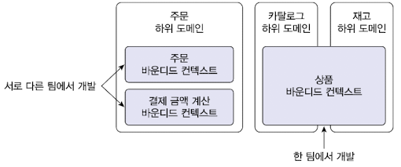
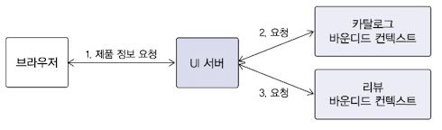
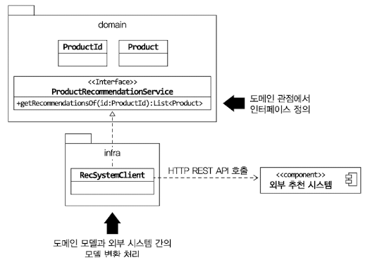

# Chapter 9 - 도메인 모델과 바운디드 컨텍스트

## 9.1 도메인 모델과 경계

완벽한 단일 도메인 모델을 만든다 > 오히려 모든 하위 도메인에 맞지 않는 모델이 될 수 있다.

예시1) 상품 - 카탈로그의 상품(상품에 대한 디테일 정보), 재고관리의 상품(N개의 상품에 대한 재고)
예시2) 고객 - VOC의 고객(문의 접수자), 계약관리의 고객(계약자), 주문(주문자), 배송(보내는 사람)

즉, 같은 용어라도 의미가 다를수 있고 같은 대상을 다른 용어로 부를수 있기 때문에 하나의 모델로 모든 하위 도메인을 표현할 수 없다.  
따라서 하위 도메인마다 모델을 만들어야 한다.

모델은 특정한 컨텍스트 하에서 완전한 의미를 갖는다. 이를 구분짓는 경계를 바운디드 컨텍스트라 부른다.

## 9.2 바운디드 컨텍스트

- 바운디드 컨텍스트는 모델의 경계를 결정하며 한 개의 바운디드 컨텍스트는 논리적으로 한개의 모델을 갖는다.
- 바운디드 컨텍스트는 용어를 기준으로 구분 한다.

기업 또는 팀구조에 따라 하나의 하위 도메인에서 두가지 바운디드 컨텍스트를 다루기도 하고, 하나의 바운디드 컨텍스트에서 두가지 도메인을 다루기도 한다.



여러 하위 도메인을 하나의 바운디드 컨텍스트에서 개발할 때 주의할 점은 하위 도메인의 모델이 섞이지 않도록 한다.  
도메인 모델이 개별 하위 도메인을 제대로 반영하지 못해서 하위 도메인별로 기능을 확장하기 어렵다. 서비스 경쟁력을 떨어뜨린다.

비록 한개의 바운디드 컨텍스트에서 여러 하위 도메인을 포함하더라도 하위 도메인마다 구분되는 패키지를 갖도록 구현해야 한다.  
그래야 하위 도메인을 위한 모델이 서로 뒤섞이지 않아서 하위 도메인마다 바운디드 컨텍스트를 갖는 효과를 낼 수 있다.  
그러면 바운디드 컨텍스트 마다 다른 모델의 모습을 갖게된다. 연관관계도 다르고, 필드도 다르다.

## 9.3 바운디드 컨텍스트 구현

도메인 모델만 포함하는 것은 아니며, 표현 영역, 응용 서비스, 인프라스트럭쳐 영역을 모두 포함한다. 또한 DB 테이블 스키마도 포함한다.

모든 바운디드 컨텍스트를 반드시 도메인 주도로 개발할 필요는 없다. 복잡한 도메인 로직을 갖지 않는다면 CRUD방식으로 구현해도 된다.  
한 바운디드 컨텍스트에서 두 방식을 혼합해서 사용할 수 있다.  
ex) CQRS: 단일 바운디드 컨텍스트에 적용한다면 상태 변경과 관련된 기능은 도메인 모델 기반으로 구현하고 조회 기능은 서비스 - DAO를 이용해서 구현한다.

- 바운디드 컨텍스트가 반드시 사용자에게 보여지는 UI를 가지고 있어야 하는 것은 아니다.
- UI를 처리하는 서버를 두고 UI서버에서 바운디드 컨텍스트와 통신해서 사용자 요청을 처리하는 방법도 있다.



## 9.4 바운디드 컨텍스트 간 통합

추천 시스템은 상품의 정보를 포함하지 않으며 상품 번호 대신 아이템 ID라는 용어를 사용해서 식별자를 표현하고 추천 순위와 같은 데이터를 담는다.  
즉, 카탈로그의 모델을 기반으로 하는 도메인 서비스를 이용해서 상품 추천 기능을 표현해야 한다.

````java
interface ProductRecommendationService {    
    List<Product> getRecommendationOf(ProductId id);
}
````
도메인 서비스를 구현한 클래스는 인프라스트럭처 영역에 위치한다.  
외부 시스템과의 연동을 처리하고 외부 시스템의 모델과 현재 도메인 모델 간의 변환을 책임진다.  



모델간 변환이 복잡하다면 변환기를 둔다.  
예를 들어 Translator라는 별도 클래스를 만들고 RecSystemClient에서 의존하게 구현하는 것도 가능하다.

간접적인 방식은 메시지 큐를 활용한다. 데이터 형식에 대한 협의 등이 필요하다.

두 바운디드 컨테스트를 개발을 한다면 데이터의 구조를 협의하게 되는데 그 큐를 누가 제공하느냐에 따라 데이터 구조가 결정된다.  
한쪽에서 메세지를 출판하고 다른 쪽에서 메세지를 구독하는 출판/구독 모델을 따른다.

> <참고> 마이크로 서비스와 바운디드 컨텍스트   
> 
> MSA는 REST API나 메시징 큐를 이용해서 통신하는 구조를 가진다.  
> 이런 마이크로 서비스의 특징은 DDD의 바운디드 컨텍스트와 잘 어울린다.  
> 각 바운디드 컨텍스트는 모델의 경계를 형성하는데 바운디드 컨텍스트를 마이크로 서비스로 구현하면 자연스럽게 컨텍스트별로 서비스가 분리된다.  
> 즉, 코드 수준에서도 컨텍스트를 분리하여 깔끔한 설계를 만들게 된다.

## 9.5 바운디드 컨텍스트 간 관계

## 9.6 컨텍스트 맵

