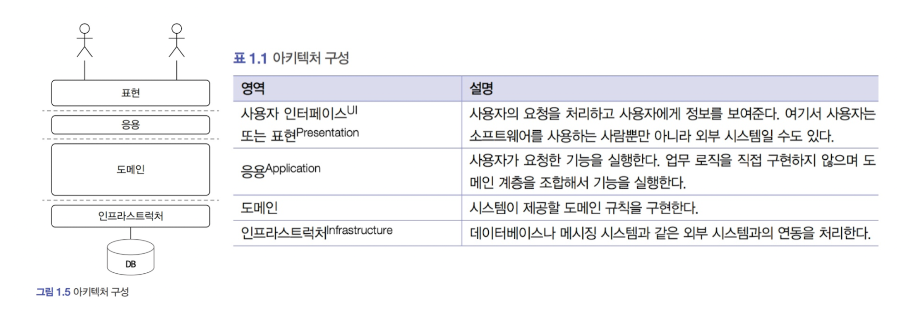

# 도메인 모델 시작하기

---
## 도메인
- 소프트웨어로 해결하고자 하는 문제 영역
- 도메인은 하위 도메인으로 구성
    - 주문(결제, 정산, 배송)
- 도메인 전문가와 개발자간 지식 공유
    - 기획자나 협업은 요구사항을 왜 요청했는지, 그 이유를 의도를 파악하는 태도를 가져보자
    - 더욱 긴밀히 소통해보자
- Garbage in, Garbage out
    - 잘못된 요구사항은 잘못된 제품으로 이어진다.
---
## 도메인 모델
- 특정 도메인을 개념적으로 표현한 것
- 도메인을 이해하는데 도움이 된다면, 클래스다이어그램, UML, 그래프 등 상관 없다.
- 여러 하위 도메인을 하나의 다이어그램에 모델링하면 안됨
    - 하위 도메인이 다루는 영역은 서로 다르기 때문에 같은 용어라도 하위 도메인마다 의미가 달라지기 때문
- 일반적인 어플리케이션의 아키텍처는 아래와 같이 네개의 영역으로 구성

- 도메인은 핵심규칙을 구현한다?
  - 주문 도메인
    - 출고 전에 배송지를 변경할 수 있다.
    - 주문 취소는 배송전에만 할 수 있다.
- 도메인 규칙을 객체지향으로 구현하는 패턴이 도메인 모델 패턴
- 샘플코드를 보니 어떻게 보면 도메인에 대한 요구사항을 객체지향으로 적용하는 것이 도메인을 구현한다라는 의미와 같아 보인다.
- 초기엔 완벽한 `개념 모델` 보다는 전반적인 개요를 아는 수준으로 작성 후 `점진적`으로 발전
- `개념모델`: 순수하게 문제를 분석한 결과물
- `문서화`는 지식 공유하는 작업이지 매우 중요하다.
---
## 엔티티와 밸류
- 깨알같이 불변객체 사용을 강조
### 엔티티
- uuid와 같은 `식별자`를 가짐
- 엔티티 객체마다 고유 함(ex.주문 객체의 주문번호)
- 값을 직접 입력해도 되고, `시퀀스`를 사용해도 됨
### 밸류
- `값 포장 객체`와 유사
- 주문정보 객체에 `받는사람이름`, `받는사람전화번호` 필드를 구성할 수 있지만, 하나의 객체로도 표현 가능
- 얻고자 하는 효과는 개념적으로 하나의 객체를 표현하는 것
- 밸류타입으로 의도를 전달하는 것 뿐만 아니라 메서드명 네이밍도 강조
  - setState() 가 아닌 completeState()
  - setter 지양 강조
---
## 도메인 용어
- 도메인에서 사용하는 용어, 코드의 가독성을 높여주는 용어를 정의하는 것이 중요
- 에릭에반스는 `유비쿼터스 언어`라는 용어를 사용하여 용어를 공통화 하는 것을 강조
- 하지만 우리는 한국인인데?
  - 적절히 정해서 팀내, 같은 도메인 영역과 소통에 무리만 없으면 된다.
- Step1, Step2 보다는 PAYMENT_WAITING, PREPARING 이 낫지 않은가!
