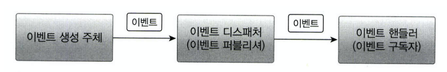
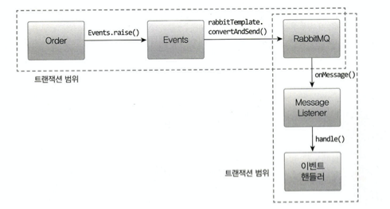
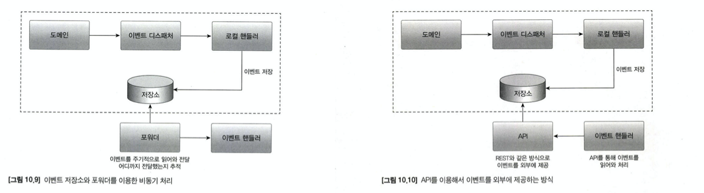
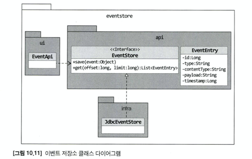

# Chapter 10 이벤트

---
## 시스템 간 강결합 문제 
- 시스템 간 강결합(high coupling) 문제를 예시를 들고 있다.  
- 바운디드컨텍스트 간의 강결합이 발생의 예시를 보여주고 있고, 사례로는 주문 로직과 결제 로직의 코드를 보여주고 있다.
- 취소요청이 왔을 때 `주문취소`와 `결제취소`가 필요하다.
- 위의 2개의 코드를 구현 시 하나의 메서드에서 수행하는 형태로 구현할 수 있다.
- 다만 도메인 관점에서 생각했을 땐, 주문 도메인과 결제 도메인이 혼합되는 상황이 발생한다.
- 그렇게되면 도메인간의 의존성이 생기는데, 이를 해결하기 위한 방법인 `이벤트`를 소개하며 챕터가 시작된다.
## 이벤트 개요
- 이벤트: 과거에 벌어진 어떤 것
- ~~가 발생하면 과 같은 요구사항을 이벤트를 이용해서 구현
    - 주문을 취소할 때 이메일을 보낸다.
- 이벤트 아키텍처의 큰 틀은 아래와 같다.

- 구현 방식은 무조건 비동기인줄 알았는데, 동기방식도 존재한다(트랜잭션 관리 등을 위함)
### 이벤트의 용도
- 도메인의 상태가 바뀔 때 다른 후처리를 실행하기 위한 `트리거`
- 다른 시스템 간의 `데이터 동기화`
### 이벤트의 장점
- 서로 다른 도메인 로직이 섞이는 것을 방지
- 기능 확장도 용이
### 이벤트, 핸들러, 디스패쳐 구현
Event 클래스
- EventHandler : 이벤트 핸들러를 위한 상위 타입, 모든 핸들러는 이 인터페이스를 구현한다.
- Events : 이벤트 디스패처, 이벤트 발행, 이벤트 핸들러 등록, 이벤트를 핸들러에 등록  

Event Handler 인터페이스
- EventHandler 인터페이슬 상속받는 클래스는 handle() 메서드를 이용해서 기능을 구현
- canHandle() 메서드를 통해 이벤트 처리 가능 여부 확인  

EventDispatcher인 Events 구현
- 도메인을 사용하는 응용 서비스는 이벤트를 받아 처리할 핸들러를 Events.handle()로 등록하고, 도메인 기능을 실행한다. 

## 동기 이벤트 처리 문제
- 현재 예시는 주문취소, 결제취소 프로세스 흐름이다.
- 결제취소는 외부 서비스에 영향을 받는 프로세스이다.
- 동기 이벤트를 설계 했는데 `주문취소`는 성공하고, `결제취소`는 실패했다면?
- 위와 같은 이슈로 분리하여 `비동기`로 처리하거나, `이벤트와 트랜잭션을 연계`하는 것을 추천한다.

## 비동기 이벤트 처리
로컬 핸들러를 비동기로 실행( 소스코드 추후에 추가)

메시지 큐
- 이벤트가 발생하면, 이벤트 디스패처는 이벤트를 메시지 큐에 보낸다.
- 큐는 이벤트를 메시지 리스너에 전달하고, 메시지 리스너는 이벤트 핸들러를 이용해서 처리한다.
- 도메인 기능을 실행한 결과를 DB에 반영하고, 이벤트를 메시지 큐에 저장하는 것을 같은 트랜잭션 범위에서 해야한다면, 글로벌 트랜잭션 필요
  -> 안전하지만, 성능이 떨어지는 단점이 있다.

- 많은 경우 이벤트를 발생하는 주체와 이벤트 핸들러가 별도 프로세스에서 동작한다.
- kafka는 글로벌 트랜잭션을 지원하지 않는다.

- 이벤트 저장소와 이벤트 포워더 사용
- 이벤트 저장소와 이벤트 제공 API 사용

## 이벤트 적용 시 추가 고려 사항
1. 발생 주체에 대한 정보
2. `포워더`에서 전송 실패를 얼마나 허용할 지
    - 실패한 이벤트의 재전송 횟수 제한
    - 동일 이벤트를 전송하는 데 3회 실패했다면 해당 이벤트는 생략하고 다음 이벤트로  넘어가는 정책 필요
3. `이벤트 손실`
    - 이벤트 저장소를 사용하는 방식은 이벤트 발생과 이벤트 저장을 `한 트랜잭션`으로 처리
    - 트랜잭션에 성공하면 저장소에 이벤트 보관이 보장
    - 비동기로 처리 후 실패하면? 이벤트 유실 발생
4. `이벤트 순서`
    - 이벤트 저장소는 저장소에 이벤트를 발생 순서대로 저장하기 때문에 순서 보장
    - 메시징 시스템은 기술에 따라 이벤트 발생 순서, 전달 순서가 다를 수 있음
- 추가: `멱등성`을 보장해야하지 이벤트 중복 발생이나 중복처리에 대한 부담을 줄일 수 있다.
### 이벤트 처리와 DB 트랜잭션 고려
- 동기/비동기 처리 방식을 고려해서 트랜잭션도 고려해야 한다.
- 트랜잭션의 경우의 수를 줄이는 방법은 `트랜잭션이 성공할 때`만 `이벤트 핸들러를 실행`

~~~java
import org.springframework.transaction.event.TransactionPhase;
import org.springframework.transaction.event.TransactionalEventListener;

@TransactionalEventListener(
        classes = OrderCanceldEvent.class,
        phase = TransactionPhase.AFTER_COMMIT
)
public void handle(OrderCanceldEvent event) {
    refundService.refund(event.getOrderNumber());
}
~~~
