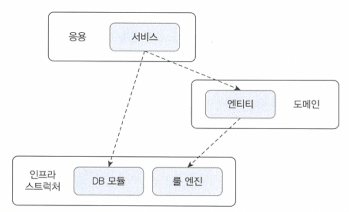
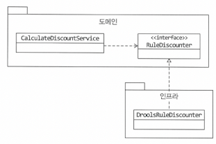
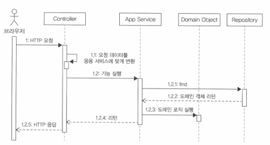

# Chapter 2 - 아키텍처 개요
## 2.1 네 개의 영역
* 아키텍처를 설계할 때 출현하는 네가지<br>
'표현', '응용', '도메인', '인프라스트럭처'<br>
* 표현 영역 : HTTP 요청을 응용 영역이 필요로 하는 형식으로 변환해서 응용영역으로 전달, 
 응용영역의 응답을 HTTP 응답으로 변환하여 전송
* 응용 영역 : 시스템이 사용자에게 제공해야 할 기능 구현 
  - ex) '주문등록', '주문취소', '상품상세조회' <br>
  - 기능을 구현하기 위해 도메인 영역의 도메인 모델 사용<br>
  - 로직을 직접 수행하기보다는 도메인 모델에 로직 수행 위임
* 도메인 영역 : 도메인의 핵심 로직을 구현 
  - ex) '배송지변경', '결제완료', '주문총액계산'
* 인프라스트럭처 영역 : 구현 기술에 대한 것<br>
  - ex) RDBS 연동을 처리하고, 메시징 큐에 메세지를 수신하는 기능 구현, 몽고DB나 레디스와의 데이터 연동처리
  - 도메인 영역, 응용 영역, 표현 영역은 인프라스트럭처 영역에서 제공하는 기능을 사용해서 필요한 기능을 개발한다.<br>
## 2.2 계층 구조 아키텍처
* 표현 영역과 응용 영역은 도메인 영역을 사용하고, 도메인 영역은 인프라스트럭처 영역을 사용한다.
* 상위 계층에서 하위 계층으로의 의존만 존재, 하위 계층은 상위 계층에 의존하지 않는다.
* 응용 영역과 도메인 영역은 DB나 외부 시스템 연동을 위해 인프라스트럭처의 기능을 사용



* 표현, 응용, 도메인 계층이 상세한 구현 기술을 다루는 인프라스트럭처 계층에 종속되고 있다.
* 인프라스트럭처에 의존하면 '테스트 어려움'과 '기능 확장의 어려움'이라는 두 가지 문제가 발생한다.

## 2.3 DIP
CalculateDiscountService는 고수준 모듈이다. 고수준 모듈이 제대로 동작하려면 저수준 모듈을 사용해야 한다.<br>
이때 , 구현 변경과 테스트가 어렵다는 문제가 발생한다.

DIP는 이 문제를 해결하기 위해 저수준 모듈이 고수준 모듈에 의존하도록 바꾼다.
정답은 추상화한 인터페이스에 있다.

```java
public interface RuleDiscounter {
    public Money applyRules(Customer customer, List<OrderLine> orderLines);
}
```
CalculateDiscountService가 RuleDiscounter를 이용하도록 바꾼다.
```java
public class CalculateDiscountService {
	private RuleDiscounter ruleDiscounter;
	public Money calculateDiscount(List<OrderLine> orderLines, String customerId) {
		Customer customer = customerRepository.findCusotmer(customerId);
		return ruleDiscounter.applyRules(customer, orderLines);
	}
}
```
DroolsRuleEngine 클래스를 RuleDiscounter 인터페이스로 구현체로 변경
```java
public class DroolsRuleDiscounter implements RuleDiscounter{
	private KieContainer kContainer;
	@Override
	public void applyRules(Customer customer, List<OrderLine> orderLines) {
		...
	}
}
```
CaculateDiscountService에는 Drolls에 의존하는 코드가 없다.<br>
'룰을 이용한 할인 금액 계산'을 추상화한 RuleDiscounter 인터페이스에 의존할 뿐이다.<br>
RuleDiscounter인터페이스는 고수준 모듈에 속한다.<br>
DroolsDiscounter는 고수준의 하위 기능인 RuleDiscounter를 구현한 것이므로 저수준 모듈에 속한다.<br>

DIP를 적용하면, 저수준 모듈이 고수준 모듈에 의존하게 된다.<br>
고수준 모듈이 저수준 모듈을 사용하려면 고수준 모듈이 저수준 모듈에 의존해야 하는데, <br>
반대로 저수준 모듈이 고수준 모듈에 의존한다고 해서 이를 DIP(Dependency inversion principle), 의존 역전 원칙이라고 한다.<br>

DIP를 적용하면 구현 교체가 어렵다는 것과 테스트가 어려운 문제를 해소할 수 있다.<br>

- 구현 기술 교체 문제
고수준 모듈은 저수준 모듈에 의존하지 않고, 구현을 추상화한 인터페이스에 의존한다.
```
//사용할 저수준 객체 생성
RuleDiscounter ruleDiscounter = new DroolsRuleDiscounter();

//생성자 방식으로 주입
CalculateDiscountService disService = new CalculateDiscountService(ruleDiscounter);
```

구현 기술을 변경해도 CaculateDiscountService를 수정할 필요가 없다.<br>
다음처럼 사용할 저수준 구현 객체를 생성하는 코드만 변경하면 된다.<br>
```java
//사용할 저수준 객체 변경
RuleDiscounter ruleDiscounter = new SipleRuleDiscounter();

//사용할 저수준 모듈을 변경해도 고수준 모듈을 수정할 필요가 없다.
CalculateDiscountService disService = new CalculateDiscountService(ruleDiscounter);
```
테스트코드를 작성할 때도 Mock 프레임워크를 이용해서 대역 객체를 생성해서 할 수 있다.

## 2.3.1 DIP 주의사항
DIP를 잘못 생각하면 단순히 인터페이스와 구현 클래스를 분리하는 정도로 받아들일 수 있다.<br>
하위 기능을 추상화한 인터페이스는 고수준 모듈 관점이다.<br>


### 2.3.2 DIP와 아키텍처
인프라스트럭처 영역은 구현 기술을 다루는 저수준 모듈이고 응용 영역과 도메인 영역은 고수준 모듈이다.<br>
인프라스트럭처에 위치한 클래스가 도메인이나 응용 영역에 정의한 인터페이스를 상속받아 구현하는 구조가 되므로
도메인과 응용 영역에 대한 영향을 주지 않거나 최소화하면서 구현 기술을 변경하는 것이 가능하다.


## 2.4 도메인 영역의 주요 구성요소
- 엔티티 (ENTITY) : 고유의 식별자를 갖는 객체로 자신의 라이프 사이클을 갖는다.<br>
- 밸류 (VALUE) : 고유의 식별자를 갖지 않는 객체로 주로 개념적으로 하나인 값을 표현할 때 사용된다.<br>
- 애그리거트 (AGGREGATE) : 애그리거트는 연관된 엔티티와 밸류 객체를 개념적으로 하나로 묶은 것이다.<br>
- 리포지터리 (REPOSITORY) : 도메인 모델의 영속성을 처리한다.<br>
- 도메인 서비스 (DOMAIN SERVICE) : 특정 엔티티에 속하지 않은 도메인 로직을 제공한다.<br>

### 2.4.1 엔티티와 밸류
DB 테이블의 엔티티와 도메인 모델의 엔티티는 같은 것이 아니다.<br>
도메인 모델의 엔티티는 단순히 데이터를 담고 있는 데이터 구조라기 보다는, 데이터와 함께 기능을 제공하는 객체이다.<br>
도메인 모델의 엔티티는 두 개 이상의 데이터가 개념적으로 하나인 경우 밸류 타입을 이용해서 표현할 수 있다는 것이다.<br>
밸류는 불변으로 구현할 것을 권장하며, 이는 엔티티의 밸류 타입 데이터를 변경할 때는 객체 자체를 완전히 교체한다는 것이다.<br>

### 2.4.2 애그리거트
애그리거트 : 관련 객체를 하나로 묶은 군집 <br>
ex)'주문', '배송지 정보', '주문자', '주문목록', '총결제금액'의 하위 모델로 구성된다.<br>
이 하위 개념을 표현한 모델을 하나로 묶어서 '주문'이라는 상위 개념으로 표현할 수 있따.<br>
애그리거트는 군집에 속한 객체를 관리하는 루트 엔티티를 갖는다.<br>
루트 엔티티는 애그리거트에 속해 있는 엔티티와 밸류 객체를 이용해서 애그리거트가 구현해야 할 기능을 제공한다.<br>
애그리거트의 내부 구현을 숨겨서 애그리거트 단위로 구현을 캡슐화할 수 있도록 돕는다.<br>

### 2.4.3 리포지터리
도메인 객체를 지속적으로 사용하려면 RDBMS, NoSQL, 로컬 파일과 같은 물리적인 저장소에 도메인 객체를 보관해야한다.<br>
이를 위한 도메인 모델이 리포지터리Repository이다.<br>
리포지터리는 애그리거트 단위로 도메인 객체를 저장하고 조회하는 기능을 정의한다.<br>
도메인 모델 관점에서 OrderRepository는 도메인 객체를 영속화하는 데 필요한 기능을 추상화한 것으로 고수준 모듈에 속한다.<br>
OrderRepository를 구현한 클래스는 저수준 모듈로 인프라스트럭처 영역에 속한다.<br>

서비스에서 리포지토리를 접근하는 이유<br>
- 응용서비스는 필요한 도메인 객체를 구하거나 저장할 때 리포지터리를 사용한다.<br>
- 응용서비스는 트랜잭션을 관리하는데, 트랜잭션 처리는 리포지터리 구현 기술의 영향을 받는다.<br>
- 
## 2.5 요청 처리 흐름

사용자가 애플리케이션에 기능 실행 요청 > 표현 영역에서 요청 받음 > 데이터 형식 검사 > 응용 서비스에 기능 실행 위임 > 응용 서비스는 도메인 모델을 이용해서 기능 구현 >
리포지터리에서 가져와서 실행 or 신규 도메인 객체를 생성해서 리포지터리에 저장

## 2.6 인프라스트럭처 개요
인프라스트럭처는 표현 영역, 응용 영역, 도메인 영역을 지원한다.<br>

- 도메인 객체의 영속성 처리, 트랜잭션, SMTP 클라이언트, REST 클라이언트 등 다른 영역에서 필요로 하는 프레임워크, 구현 기술, 보조 기능을 지원한다.
- 도메인 영역과 응용 영역에 정의한 인터페이스를 인프라스트럭처 영역에서 구현하는 것이 시스템을 더 유연하고 테스트하기 쉽게 만들어준다.
- DIP의 장점을 해치지 않는 범위에서 응용 영역과 도메인 영역에서 구현 기술에 대한 의존을 가져가는 것이 좋다.

## 2.7 모듈 구성
아키텍처의 각 영역은 별도 패키지 위에 위치한다.<br>
영역별로 모듈이 위치할 패키지를 구성한다.<br>
도메인 모듈은 도메인이 속한 애그리거트를 기준으로 다시 패키지를 구성한다.<br>
애그리거트, 모델, 리포지터리는 같은 패키지에 위치시킨다.<br>
