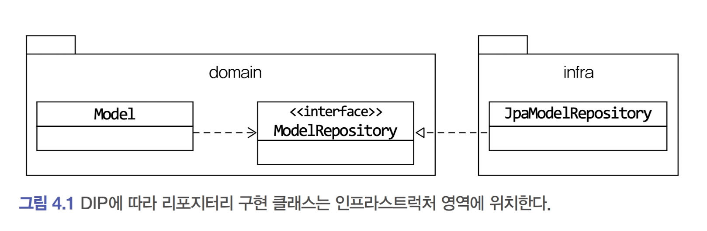

# 4. 리포지터리와 모델 구현

## 4.1 JPA를 이용한 리포지터리 구현

### 4.1.1 모듈위치

* 리포지토리 인터페이스는 애그리거트와 같이 도메인 영역에 속하고, 리포지터리를 구현하는 클래스는 인프라스트럭처 영역에 속한다.



*  가능하면 리포지토리 구현 클래스는 인프라스트럭처 영역에 위치 시켜서 인프라스트럭처에 대한 의존을 낮춰야 한다.

### 4.1.2 리포지터리 기본 기능 구현

* 리포지토리는  ID로 애그리거트 조회와 애리거트 저장 기능을 제공한다.
* 인터페이스는 애그리거트 루트를 기준으로 작성한다.
* ?? 삭제기능 : Soft delete가 좋은것일까??


## 4.2 스프링 데이터 JPA를 이용한 리포지터리 구현

* Repository에 대한 설명


## 4.3 매핑 구현

* Entity 는 @Entity로 Value는 @Embeddable 로 처리한다.
* 새로 알게된 내용으로 @ElementCollection에 값의 인덱스를 정해 줄때 @OrderColumn 을 사용하면 된다고 한다.
  * OrderColumn 으로 명시해준 인덱스는 구진 @Embeddable 클래스 내부에 변수로 선언해 주지 않아도 된다.

### 4.3.8 별도 테이블에 저장하는 밸류 매핑
* 애그리거트 루트 엔티티를 뺀 나머지 구성요소 대부분은 밸류이다. 루트 엔티티 외에 또다른 엔티티가 있다면 진짜 엔티티인지 의심해 봐야 한다.
* 밸류가 아닌 앤티티가 있다면 해당 엔티티가 다른 애그리거트는 아닌지 확인해야 한다.
  * 독자적인 라이프 사이클을 갖는다면 구분되는 애그리거트일 가능성이 높다.
* id르 가지고 있지만 value 객체라면 @SecondaryTable을 사용하면 된다.
* SecondaryTable로 연결된 엔티티를 조회할때 포함된 값객체 까지 조회하길 원하지 않을때는 전용쿼리를 실행하는게 좋다.

### 4.3.9 밸륨 컬렉션을 @Entity로 매핑하기

* 위와 같은 상속 구조를 갖는 밸류 타입은 @Embeddable 로 처리하기 힘들므로 @Entity를 활용해야 한다.
* @Entity 와 @DiscriminatorColumn 을 이용해서 엔티티의 형태를 가지고 있지만 이미지는 value 이므로 상태를 변경하는 메서드는 가지고 있으면 안된다.

```java
@Entity
@Table(name = “product”)
public class Product {
  @EmbeddedId
  private ProductId id;
  private String name;
  @Convert(converter = MoneyConverter.class)
  private Money price;
  private String detail;
  @OneToMany(
  cascade = {CascadeType.PERSIST, CascadeType.REMOVE},
  orphanRemoval = true)
  @JoinColumn(name = “product_id”)
  @OrderColumn(name = “list_idx”)
  private List<Image> images = new ArrayList<>();
    ...
  public void changeImages(List<Image> newImages) {
    images.clear();
    images.addAll(newImages);
  }
 
```
* 위의 changeImage 메서드 호출시 @Entity로 구현된 이미지는 조회 쿼리후 삭제가 가능하다고 한다.
* 이 빈도가 낮으면 문제가 되지 않지만 성능을 위해서 이를 포기해야 한다면 Image를 @Embeddable로 처리하고 타입을 if else로 하는 방법도 고려해 봐야 한다.


## 4.4 애그리거트 로딩 전략
* JPA매핑 설정시 애그리거트에 속한 객체가 모두 모여야 완전한 하나가 된다.
* 이러한 완전한 객체를 조회하기 위해 Fetch유형을 eagle로 하게되면 카타시안 조인으로 인해 지나치게 많은 행이 반환될 수 있다.
* 어그리거트가 완전해야 하는 이유는 
  * 상태를 변경하는 기능을 실행할때 애그리거트 상태가 완전해야 하고
  * 표현 영역에서 애그리거트 상태를 보여줄때 필요하기 때문이다.
* 이중 두번째는 조회 전용 기능으로 분리해도 되고 첫번째는 지연로딩을 통해서도 처리가 가능하다
* 지연로딩의 경우 카타시안 조인에는 유리하지만 쿼리 실행 횟수가 많아질 가능성이 높으므로 상황에 따라서 맞춰서 쓰는게 중요하다.

## 4.5 애그리거트 영속성 전파
* 애그리거트가 완전한 상태라는 것은 조회 뿐만 아니라 저장, 삭제 할때도 함께 처리해야 함을 의미한다.
* @Embeddable 매핑 타입은 함께 저장되고 삭제되므로 cacade속성을 추가 설정할 필요없지만 @Entity타입에 대한 매핑을 cascade 속성을 사용해서 저장과 삭제시 함꼐 처리되도록 하여야 한다.

## 4.6 식별자 생성 기능
* 사용자 직접 생성
  * 사용자가 직정 생성하는 경우 생성 규칙을 도메인 영역에서 확인해 주면 된다.
* 도메인 로직으로 생성
  * 응용서비스가 아닌 도메인 서비스 혹은 리포지토리에서 생성하도록 한
* DB를 이용한 일려번호 사용
  * @GenerateValue 를 사용한다.
  
## 4.7 도메인 구현과 DIP
* JPA사용시 도메인 객체에 @Entity @Table 과 같은 구현체인 JPA에 특화된 어너테이션이나 Repository 에는 JPARepostiroy 를 상속받아서 사용해야 한다.
* 이는 고수준이 저수준에 영향을 주는게 사실이지만 실질적으로 구현기술이 변경되는 상황이 없다면 타협의 필요 성도 있다.