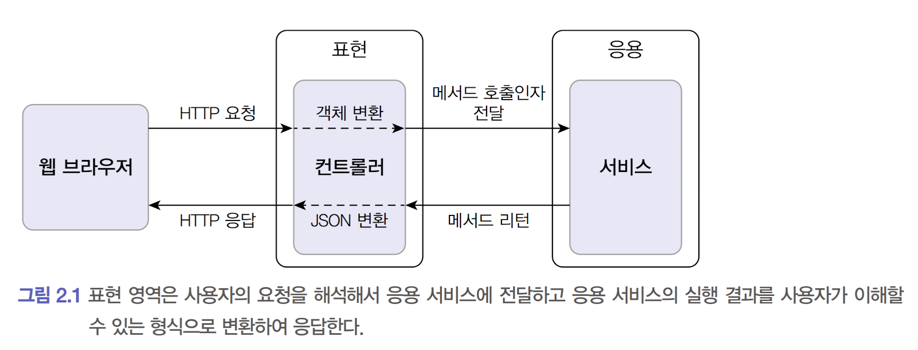
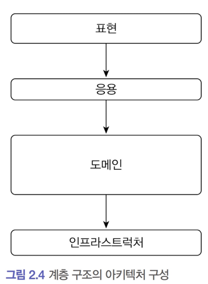
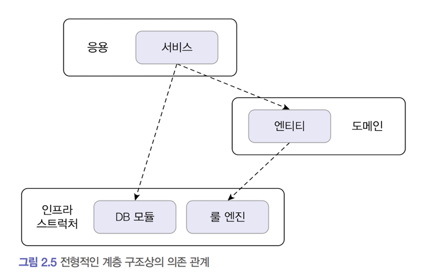
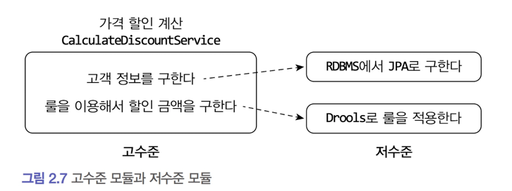
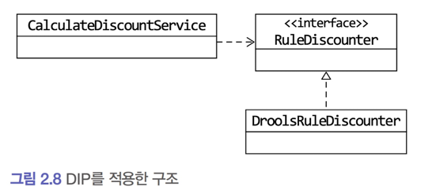
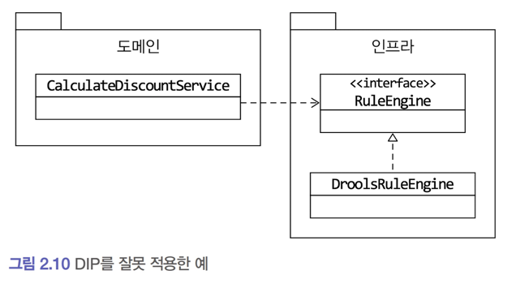

## Chapter2 아키텍처 개요

## 2.1 네 개의 영역

`표현`, `응용`, `도메인`, `인프라스트럭처`는 아키텍처를 설계할 때 출현하는 전형적인 네 가지 영역이다.

### 표현 영역



* 웹 애플리케이션에서 표현 영역의 사용자는 사람일 수도 있고, REST API를 호출하는 외부 시스템일 수도 있다.
* [그림2.1]에서와 같이 웹 애플리케이션에서 표현 영역은 HTTP 요청을 응용 영역이 필요로 하는 형식으로 변환해서 응용 영역에서 반환된 결과를 JSON과 같은 형태로 변환해서
  HTTP응답으로 반환하는 역활을 한다.

### 응용 영역

* 사용자에게 제공해야 할 기능을 구현하는 영역
* 응용 영역은 기능을 구혀나기 위해 도메인 영역의 도메인 모델을 사용

```java
public class CancelOrderService {

    @Transactional
    public void cancelOrder(String orderId) {
        Order order = findOrderById(orderId);
        if (order == null)
            throw new OrderNotFoundException(orderId);
        order.cancel();
    }
}
```

* 위 예제는 응용 영역에서 주문을 취소하기 위해 도메인 모델을 이용하는 예제

### 도메인 영역


* 도메인 영역은 도메인 모델을 구현한다.
* 도메인 모델은 '배송지 변경', '주문 취소'와 같은 도메인의 핵심 로직을 구현한다.

### 인프라스트럭처 영역

* 인프라스트럭처 영역은 구현 기술에 대한 것을 다룬다.
* 논리적 개념보다는 실제 구현을 다룬다.
    * RDBMS연동 처리
    * HTTP Client를 이용한 호출
    * 메시지 전송

---

## 2.2 계층 구조 아키텍처



* [그림 2.4]와 같이 계층 구조는 크게 네개의 영역으로 나뉜다.
* 각 계층각 의존은 단뱡향으로 흐른다.
* 원칙 상 상위계층은 바로 하위계층에만 의존 해야 하지만 아래와 같은 구조로 계층간 의존을 하게 되는 경우가 많다.
  
* 계층 구조에서는 DB와 같은 외부 시스템 연동을 위해 인프라스트럭처 계층에 종속되는 경우가 많다.
    * 인프라스트럭처에 의존하게 되면 의존하고 있는 기능을 구현하기 전에는 테스트가 불가능 하다.
    * 인프라스트럭처에 직접적으로 의존하지 않더라도 간접적 의존으로 의해 확장성이 떨어질 수 있다.
* 두 문제를 해결하기 위한 방법이 DIP이다

## 2.3 DIP



* 고수준 모듈이 동작하기 위해서는 저수준 모듈의 도움이 필요하지만 [그림 2.7]과 같이 구현한다면 위에서 언급한대로 변경과 테스트가 어렵다는 문제가 발생한다.
* DIP를 사용하면 저수준 모듈에 고수준 모듈을 의존하도록 바꿀 수 있다.



* Drool로 룰을 적용한다는 저수준이 아닌 할인금액 계산 룰 적용이라는 고수준 모듈을 참조하고 해당 고수준 모듈을 Drool룰이 구현하도록 하여 의존서이 역전되었다.
* CalculateDiscountService 에서는 DroolsRuleDiscounter 가 아닌 간단한 구현체를 이용한 테스트가 가능해 졌다.
* Rule이 변경될경우에도 해당하는 Rule을 새로 구현하면 되므로 확장에도 열려있게 되었다.

### 2.3.1 DIP 주의 사항

* DIP는 단순히 인터페이스 구현 클래스를 분리하는 것이 아니다.
  
* 저 수준 기준에서 인터페이스를 도출하는 경우 여전히 저수준을 의존하게 될 수 있다.
* 할인금액계산이라는 관점에서 엔진을 쓸지 말지는 중요하지 않음
* RuleDiscounter : 할인 금액 계산 룰 (O)
* RuleEngine : 엔진 룰 (?)  

