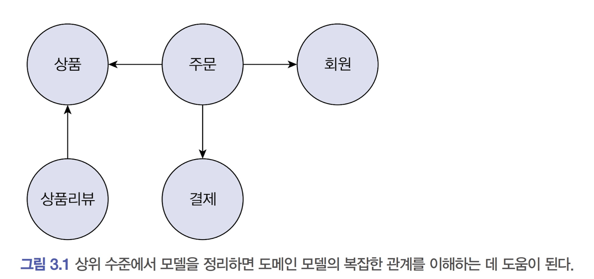
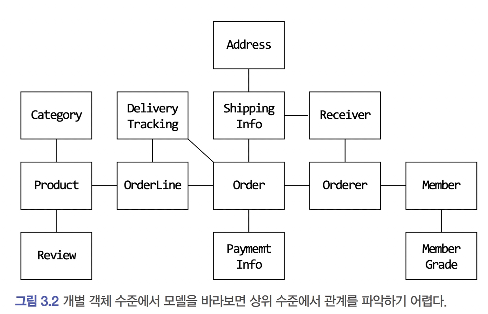
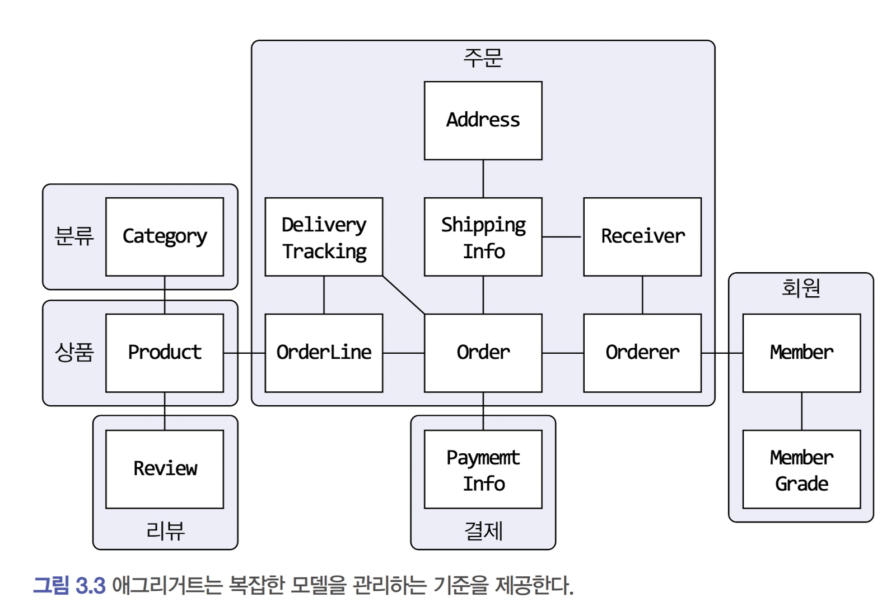

# 애그리거트

## 3.1 애그리거트





* [그림3.1]은 상위 수준의 개념을 모델로 정리한 것이고 [그림3.2]는 상위 모델을 객체 단위로 그린 것이다.
* 상위 수준의 개념을 파악 후 객체 모델을 파악하면 전반적인 구조를 이해하기 쉽지만 반대의 경우는 어렵다.
* 위의 그림의 예시를 봤을때 주요 도메인 요소 간의 관계(상위 수준 개념)를 파악하기 어려운 것은 코드를 변경하고 확장하는 것이 어려워 진다는 것을 의미한다.
* 그러므로 복잡한 도메인을 이해하고 관리하기 쉬운 단위로 만들려면 상위 수준에서 모델을 조망할 수 있는 방법이 필요하고 그 방법이 바로 `애그리거트`다.
* 애그리거트는 관련된 객체를 하나의 군으로 묶어주고 이를 보면 상위수준에서 도메인 간의 관계를 파악할 수 있다.




* 위와 같은 애그리거트 단위로 군집시킬 경우 도메인의 복잡도를 낮춰주고, 복잡도가 낮아진 만큼 도메인 기능을 확장하고 변경하는 데 필요한 노력도 줄어든다.
* 예시로 위의 주문 애그리거트를 만들려면 Orderer, OrderLine, ShippingInfo 등이 함께 생성되야 한다는것을 알 수 있다.
* 애그리거트 내에 포함된 구성요소들은 같은 라이프사이클은 가지며 다른 애그리거트를 관리하지 않기 때문에 유지보수성이 올라간다.


* 이러한 경계를 정하는 방법은 도메인 규칙과 요구사항이다.
* 상품과 리뷰는 언뜻보면 하나의 군집으로 생각될 수 있지만 상품과 리뷰는 함께 생성되지도 변경되지도 않으므로 다른 애그리거트에 속한다고 할 수 있다 (도메인에 따라 아닐 수도 있다.)
* 중한것은 처음에는 같은 애그리거트라고 생각이 들더라도 비즈니스에 대한 이해도가 올라가고 도메인 규칙을 제대로 이해할수록 애그리거트의 실제 크기는 점점 줄어들게 된다.

---


## 3.2 애그리거트 루트

* 애그리거트는 여러 객체로 구성되기 때문에 한 객체만 상태가 정상이면 안 된다.
* 도메인 규칙을 지키려면 어그리거트에 속한 모든 객체가 정상 상태를 가져야 한다.
* 이렇게 모든 객체가 정상 상태를 가지려면 애그리거트 전체를 관리할 주체가 필요한데, 이 책임을 가지는것이 애그리거트 루트 엔티티다.
* 애그리거트에 속한 객체는 직접, 간접적으로 루트에 속하게 된다.


#### 3.2.1 도메인 규칙과 일관성

* 애거리거트 루트는 애그리거트에 속한 객체의 일관성이 꺠지지 않도록 해야 하기 때문에 기능을 구현한 메서드를 제공해야 한다.

```java
public class Order {
 // 애그리거트 루트는 도메인 규칙을 구현한 기능을 제공한다.
 public void changeShippingInfo(ShippingInfo newShippingInfo) {
   verifyNotYetShipped();
   setShippingInfo(newShippingInfo);
 }
 private void verifyNotYetShipped() {
   if (state != OrderState.PAYMENT_WAITING && state != OrderState.PREPARING)
   throw new IllegalStateException(“aleady shipped”);
 }
}

```

위와 같은 예제에서 아래와 같이 간적적인 객체의 값을 직접 수정한다면 일관성은 깨지게 되므로 옳지 않다.

```java
ShippingInfo si = order.getShippingInfo(); 
si.setAddress(newAddress);
```


* 에그리거트 루트를 통해서만 도메인 로직을 구현하게 만드려면 아래 두가지 습관을 적용해야 한다.
  * 단순히 필드를 변경하는 set 메서드를 공객 범위로 만들지 않는다.
  * 밸류 타입은 불변으로 구현한다.


#### 3.2.2 애그리거트 루트의 기능 구현

* 애그리거트 루트는 애그리거트 내부의 다른 객체를 조합해서 기능을 완성한다.
* 예제)주문은 총 주문 금액을 구하기 위해 주문항목을 이용한다.

```java
public class Order {
 	private Money totalAmounts;
 	private List<OrderLine> orderLines;
 
  private void calculateTotalAmounts() {
    int sum = orderLines.stream()
      .mapToInt(ol -> ol.getPrice() * ol.getQuantity())
   		.sum()
 		this.totalAmounts = new Money(sum);
  }
}
```

* 내부의 값을 꺼내서 변경하여 상태가 달라지는 버그를 방지하기 위해 불변이나, 메서드 범위를 제한하는 방법을 사용해야 한다.
* 예제

```java
OrderLines lines = order.getOrderLines();
// 외부에서 애그리거트 내부 상태 변경!
// order의 totalAmounts가 값이 OrderLines가 일치하지 않게 됨
lines.changeOrderLines(newOrderLines);
```


#### 3.2.3 트랜잭션 범위

* 한 트랜잭션에 한 개의 애그리거트만 수정해야 한다. 
* 한 트랜잭션에서 한 애그리거트만 수정한다는 것은 애그리거트에서 다른 애그리거트를 변경하지 않는다는 것을 의미한다.
* 예제) 배송지 정보를 변경하면서 동시에 배송지 정보를 회원의 주소로 설정하는 기능이 있다. 이때 아래와 같이 진행해서는 안된다.

```java
public class Order {
 
  private Orderer orderer;
 
  public void shipTo(ShippingInfo newShippingInfo,boolean useNewShippingAddrAsMemberAddr) {
 		verifyNotYetShipped();
 		setShippingInfo(newShippingInfo);
 		if (useNewShippingAddrAsMemberAddr) {
 			// 다른 애그리거트의 상태를 변경하면 안 됨!
 			orderer.getMember().changeAddress(newShippingInfo.getAddress());
 		}
 	}
 ...
```

* 이렇게 한 애그리거트가 다른 애그리거트의 상태를 변경하면 서로의 결합도가 올라가게 된다.
* 만약 한 트랜잭션으로 두 개 이상의 애그리거트를 수정해야 한다면 응용 서비스에서 두 애그리거트를 수정하도록 구현한다.

```java
public class ChangeOrderService {
 // 두 개 이상의 애그리거트를 변경해야 하면, 
 // 응용 서비스에서 각 애그리거트의 상태를 변경한다.
 @Transactional
 public void changeShippingInfo(OrderId id, ShippingInfo newShippingInfo,
 	boolean useNewShippingAddrAsMemberAddr) {
 	Order order = orderRepository.findbyId(id);
 	if (order = = null) throw new OrderNotFoundException();
 	order.shipTo(newShippingInfo);
 	if (useNewshippingAddrAsMemberAddr) {
 		Member member = findMember(order.getOrderer());
 		member.changeAddress(newShippingInfo.getAddress());
 	}
 }
 ...

```


## 3.3 리포지터리와 애그리거트