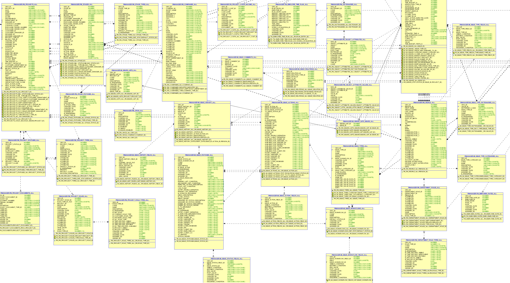
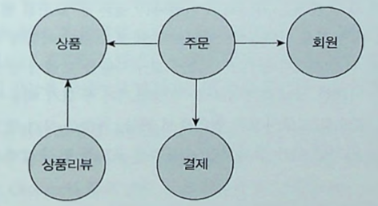
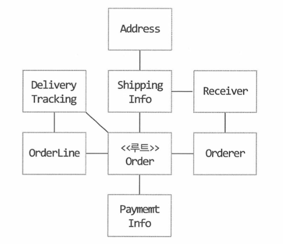

# 3장. 애그리거트

## 3.1 애그리거트


- 복잡한 도메인을 상위 모델에서 볼 수 있는 방법이 필요한데 그 방법이 애그리거트다.



- 애그리거트는 **동일한 라이프 사이클**을 가지고 대부분 함께 생성되고 제거된다. [code](./domain/order/Order.java)
- 한 애그리거트의 구성요소?
  - **같이 생성되거나 함께 변경**되는 빈도가 높다면 한 애그리거트에 속할 가능성이 높다. (Product vs Review -> 다른 애그리거트)

## 3.2 애그리거트 루트

- 애그리거트에 속한 모든 객체가 일관된 데이터를 유지하기 위해 관리의 책임을 지는 주체가 필요한데 이걸 **애그리거트 루트**라 부른다.



```java
Order order = member.getRecenOrder();
order.setAddress("성남시 ~~");
```

- 애그리거트 루트를 통해서만 도메인 로직을 구현하게 만들려면 두 가지를 기억하자.
  - **public한 set 메소드를 제공하지않는다.**
    - public set 메소드는 도메인 모델에서 수정하는게 아니라 다른 layer로 수정 범위를 분산시킨다.
    - public set 메소드를 쓰지 않으면 cancel, changeAddress 등 의미가 드러나는 이름을 사용할 수 있다.
  - **밸류 타입은 불변으로 구현한다.**
    - 외부에서 애그리거트 루트를 통해 구한 밸류를 변경할 수 없다.
    - 밸류 타입의 상태 변경은 오직 애그리거트 루트를 통해서만 가능하다.

- 애그리거트 루트는 내부의 다른 객체를 **조합**하거나 **위임**을 통해 기능을 완성한다.
  - 조합 [code](./domain/order/Order.java)
  - 위임 [code](./domain/order/OrderLines.java)
    - 만약 Order에서 OrderLines를 외부로 제공해야 한다면 불변 객체를 생성 or 메소드를 패키지, protected 레벨로 수정하자.

- 한 트랜잭션에는 한 개의 애그리거트만 수정하자.
  - 나쁜 예 [code](./domain/order/Order.java)
  - 부득이하게 해야 한다면 service에서 각 애그리거트 상태를 변경한다. [code](./OrderService.java)

## 3.3 리포지터리와 애그리거트
- 애그리거트는 한 개의 도메인 모델을 표현하므로 **리포지터리는 애그리거트 단위**로 존재한다.
- 즉 DB 테이블이 Order와 OrderLine이 물리적으로 따로 있더라도 repository는 OrderRepository 하나만 존재한다.
- 애그리거트 루트를 조회 및 저장할 때 **관련된 객체들 모두 같이 저장되고 조회**되어야 한다.

## 3.4 ID를 이용한 애그리거트 참조 (우태켐 의존성 제거 작업이 기억남)
- 애그리거트 간 참조는 **필드**를 통해 쉽게 구현할 수 있다. [code](./domain/order/Orderer.java)
- JPA는 연관관계 어노테이션(ManyToOne, OneToOne)을 이용해서 다른 애그리거트의 데이터를 쉽게 조회할 수 있다.
- 하지만 필드를 이용한 애그리거트는 다음 문제를 야기할 수 있다.
  - **편한 탐색 오용**
    - 구현의 편리함으로 나도 모르게 다른 애그리거트를 수정하는 로직을 만들 수 있다. [code](./domain/order/Order.java)
  - **성능**
    - 상황에 따라 즉시로딩을 할지 지연로딩을 할지 전략을 결정해야 함
  - **확장 어려움**
    - 서비스가 커지면서 JPA와 같은 단일 기술을 사용할 수 없다면 필드를 통해 참조가 안될 수도 있다
- 그럼 어떻게 이 문제를 완화 할 수 있을까?
  - **ID를 이용해 애그리거트를 참조**하자! [code](./domain/order/Orderer2.java)
  - ID 참조를 사용하면 모든 객체가 참조로 연결되지 않고 한 애그리거트에 속한 객체들만 참조로 연결된다.
    - 애그리거트의 경계를 명확히 하고 의존성을 줄여줌. 
    - 직접 참조하지 않으므로 지연/즉시 로딩 고민 X
    - ID를 기반으로 서로 다른 구현 기술을 사용하는것도 가능해짐 (RDBMS + Mongo)
  - 만약 애그리거트가 필요하면 Service Layer에서 조회한다. [code](./OrderService2.java)
- ID 참조를 사용하면 요구사항(전체 주문과 각 주문에 따른 상품)에 따라 N+1과 같은 쿼리가 발생할 수 있다.
  - 이 때는 그 데이터에 맞는 JPQL이나 그 대안들을 사용하자.

## 3.5 애그리거트 간 집합 연관
- 개념적으로 1-N, M-N 관계로 보이지만 실제 요구사항에서 연관관계가 필요 없을 수 있다. (위에서 언급한 ID를 이용할 수 있다.)
- Category에 해당하는 상품을 조회한다는 요구사항이 존재
  - 연관관계를 생각하기 쉽지만 [code](./domain/category/Category.java)
  - 실제 기능은 페이징되서 제공된다. [code](./domain/product/ProductService.java)
- 상품과 카테고리가 다대다 관계라면
  - 카테고리에 해당하는 상품은 위의 케이스니까 제외
  - 특정 상품 페이지에 들어갔을 때 여러 카테고리가 필요 
```java
@Entity
public class Product { 
    private Set<Long> categoryIds;
}
```

## 3.6 애그리거트를 팩토리로 사용하기
- 도메인의 상태나 값을 체크하는 로직은 서비스 layer 보다는 도메인 로직에 들어가는게 좋다.
  - [BAD](./domain/product/ProductService.java)
  - [GOOD](./domain/store/Store.java)
- **애그리거트가 갖고 있는 데이터를 이용**해 다른 애그리거트를 생성해야 한다면 애그리거트에 팩토리 메소드를 구현해보자.
  - Product의 경우 Store의 식별자(id)와 Store의 상태가 필요함.
