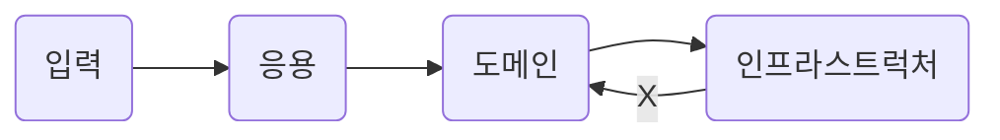
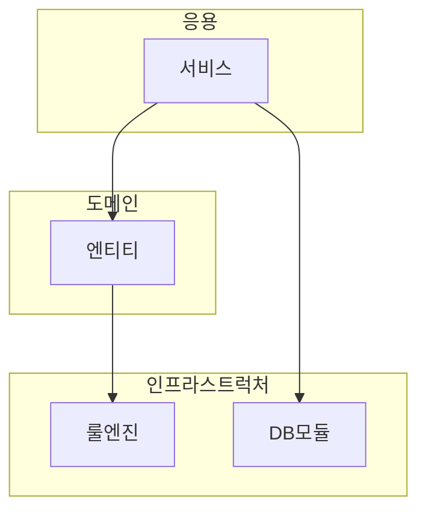
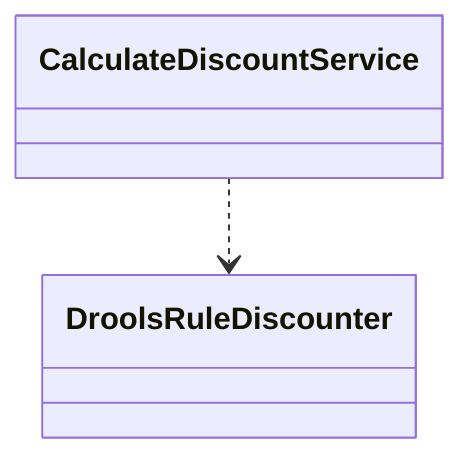
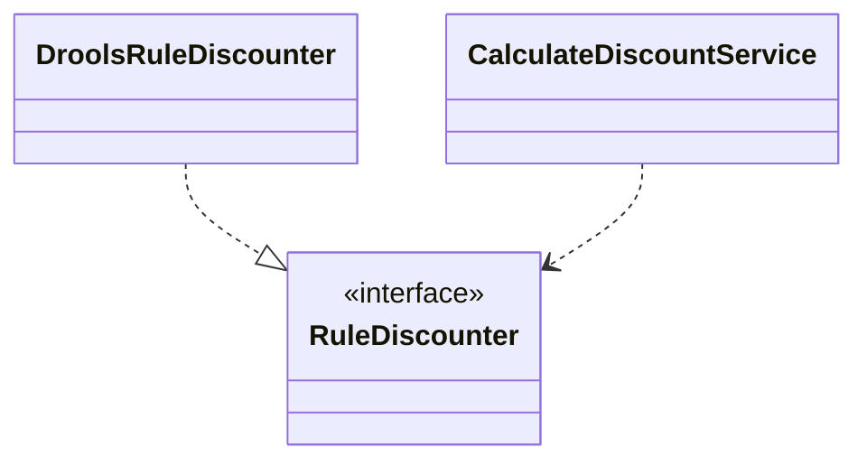

# Chapter 2. 아키텍처 개요

<!-- TOC -->

* [Chapter 2. 아키텍처 개요](#chapter-2-아키텍처-개요)
    * [2.1 네 개의 영역](#21-네-개의-영역)
    * [2.2 계층 구조 아키텍처](#22-계층-구조-아키텍처)
    * [2.3 DIP](#23-dip)
        * [2.3.1 DIP 주의사항](#231-dip-주의사항)
        * [2.3.2 DIP와 아키텍처](#232-dip와-아키텍처)
    * [2.4 도메인 영역의 주요 구성요소](#24-도메인-영역의-주요-구성요소)
        * [2.4.1 엔티티와 밸류](#241-엔티티와-밸류)
        * [2.4.2 애그리거트](#242-애그리거트)
        * [2.4.3 리포지터리](#243-리포지터리)
    * [2.5 요청 처리 흐름](#25-요청-처리-흐름)
    * [2.6 인프라스트럭처 개요](#26-인프라스트럭처-개요)
    * [2.7 모듈 구성](#27-모듈-구성)
    * [생각해봅시다..!](#생각해봅시다-)

<!-- TOC -->

---

## 2.1 네 개의 영역
- 표현(Presentation) : 사용자의 요청을 받아 응용 영역에 전달, 응용 영역의 처리결과를 다시 사용자에게 보여주는 역할
  - 표현계층과 맞닿아 있는 클라이언트는 `내/외부 시스템` 혹은 `웹 브라우저 사용자`
- 응용(Application) : 사용자에게 제공해야 할 기능을 구현, 기능을 구현하기 위해 도메인 모델을 사용한다.
- 도메인(Domain) : 도메인 모델을 구현, 로직 수행 (**Logical**)
- 인프라스트럭처(Infrastructure) : 구현 기술에 대한 것을 다룸 (**Physical**)
  - RDBMS : 연동 처리
  - 메시징 큐 : 메시지 전송 / 수신 기능 구현
  - 몽고 DB / Redis : 데이터 연동 처리
  - HTTP Client 로 내/외부 REST API 를 호출
---

## 2.2 계층 구조 아키텍처

- **_네 개의 영역은 각각이 계층으로 존재한다_**
- **계층간 의존성은 단방향**으로만 존재한다.(헐리우드 원칙)  
- 단방향을 준수한다면, 꼭 **근접한 하위 계층으로 접근하지 않아도 된다.**
  - 헐리우드 원칙 : 먼저 연락하지 마세요. 저희가 연락 드리겠습니다.

- 네 개의 영역 중, 계층구조에선 필연적으로 인프라스트럭처 계층에 종속된다.
  - 인프라스트럭처 영역에 의존하는 계층의 기능에 대해 **_테스트 하기 어렵다_**
  - 직접적인 구현에 의존하다 보니 확장하기 어렵다.
---

## 2.3 DIP
이전 계층구조에서는 의존관계가 있는 두 객체 사이간 
- 테스트 하기 어렵다
- 직접적인 구현에 의존하다 보니 확장하기 어렵다

라는 단점이 존재했다. DIP(Dependency Inversion Principle) 를 준수한다면 위와 같은 문제점에 대해 조금 더 유연하게 설계할 수 있다.

### 2.3.1 DIP 주의사항

### 2.3.2 DIP와 아키텍처

---

## 2.4 도메인 영역의 주요 구성요소

### 2.4.1 엔티티와 밸류

### 2.4.2 애그리거트

### 2.4.3 리포지터리

--- 

## 2.5 요청 처리 흐름

---

## 2.6 인프라스트럭처 개요

---

## 2.7 모듈 구성

---

## 생각해봅시다..!

- 

---