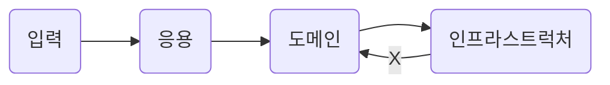
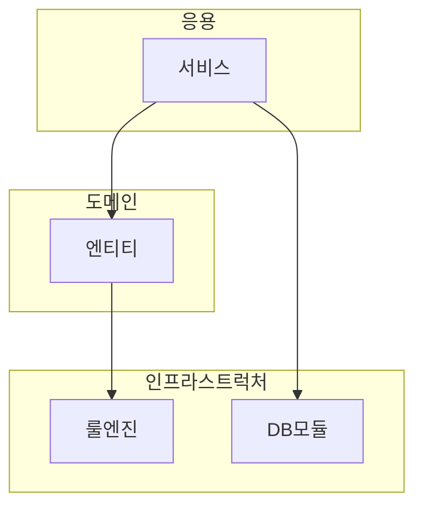
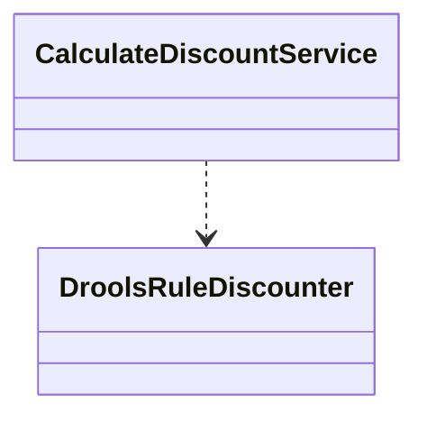
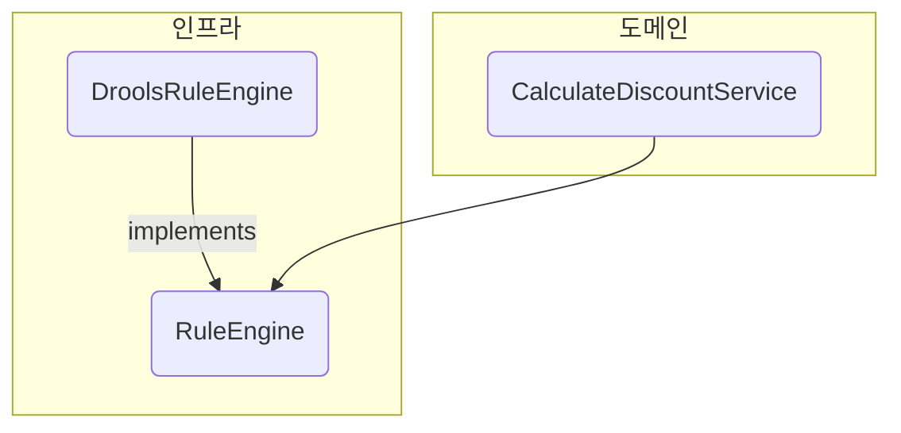
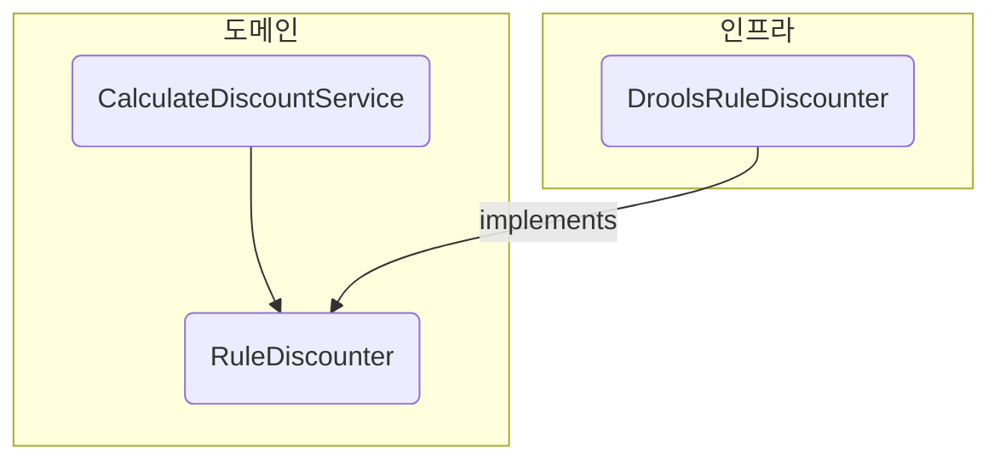
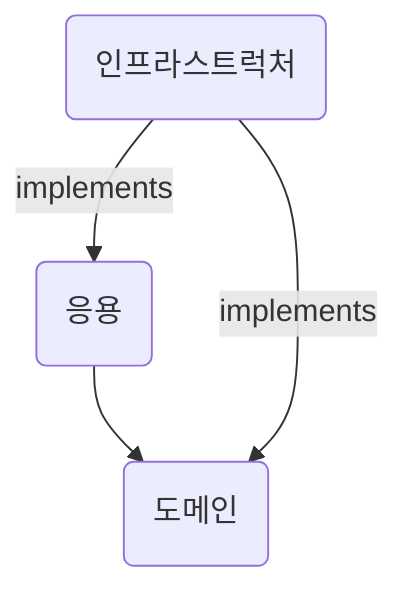
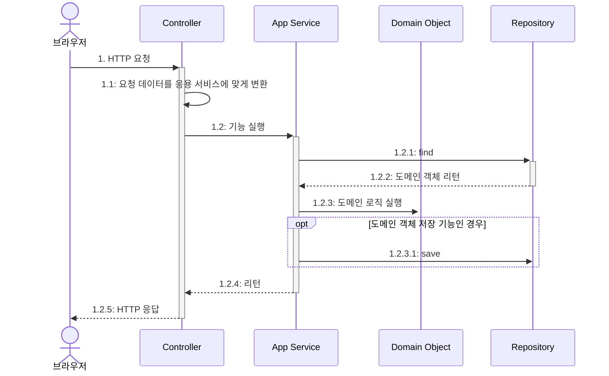
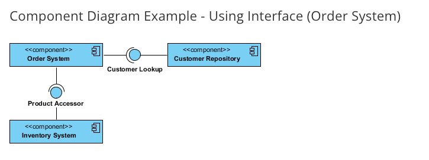

# Chapter 2. 아키텍처 개요

<!-- TOC -->

* [Chapter 2. 아키텍처 개요](#chapter-2-아키텍처-개요)
    * [2.1 네 개의 영역](#21-네-개의-영역)
    * [2.2 계층 구조 아키텍처](#22-계층-구조-아키텍처)
    * [2.3 DIP](#23-dip)
        * [2.3.1 DIP 주의사항](#231-dip-주의사항)
        * [2.3.2 DIP와 아키텍처](#232-dip와-아키텍처)
    * [2.4 도메인 영역의 주요 구성요소](#24-도메인-영역의-주요-구성요소)
        * [2.4.1 엔티티와 밸류](#241-엔티티와-밸류)
        * [2.4.2 애그리거트](#242-애그리거트)
        * [2.4.3 리포지터리](#243-리포지터리)
    * [2.5 요청 처리 흐름](#25-요청-처리-흐름)
    * [2.6 인프라스트럭처 개요](#26-인프라스트럭처-개요)
    * [2.7 모듈 구성](#27-모듈-구성)
    * [생각해봅시다..!](#생각해봅시다-)

<!-- TOC -->

---

## 2.1 네 개의 영역
- 표현(Presentation) : 사용자의 요청을 받아 응용 영역에 전달, 응용 영역의 처리결과를 다시 사용자에게 보여주는 역할
  - 표현계층과 맞닿아 있는 클라이언트는 `내/외부 시스템` 혹은 `웹 브라우저 사용자`
- 응용(Application) : 사용자에게 제공해야 할 기능을 구현, 기능을 구현하기 위해 도메인 모델을 사용한다.
- 도메인(Domain) : 도메인 모델을 구현, 로직 수행 (**Logical**)
- 인프라스트럭처(Infrastructure) : 구현 기술에 대한 것을 다룸 (**Physical**)
  - RDBMS : 연동 처리
  - 메시징 큐 : 메시지 전송 / 수신 기능 구현
  - 몽고 DB / Redis : 데이터 연동 처리
  - HTTP Client 로 내/외부 REST API 를 호출
---

## 2.2 계층 구조 아키텍처

- **_네 개의 영역은 각각 계층으로 존재한다_**
- 엄격하게 적용한다면 **계층간 의존성은 단방향**으로만 존재한다.  
  > 헐리우드 원칙 : 먼저 연락하지 마세요. 저희가 연락 드리겠습니다.
- 또한, 유연하게 적용한다면 편리함을 위해 응용 계층에서 더 아래 계층인 인프라스트럭처 계층에 의존하기도 한다.



- 네 개의 영역 중, 계층구조에선 필연적으로 인프라스트럭처 계층에 종속된다.
  - 인프라스트럭처 영역에 의존하는 계층의 기능에 대해 **_테스트 하기 어렵다_**
  - 직접적인 구현에 의존하다 보니 확장하기 어렵다.
---

## 2.3 DIP
계층구조에서는 의존관계가 있는 두 객체 사이간 
- 테스트 하기 어렵다
- 직접적인 구현에 의존하다 보니 확장하기 어렵다

라는 단점이 존재했다. DIP(Dependency Inversion Principle) 를 준수한다면 위와 같은 문제점에 대해 조금 더 유연하게 설계할 수 있다.



```mermaid
classDiagram
DroolsRuleDiscounter ..|> RuleDiscounter
CalculateDiscountService ..> RuleDiscounter

namespace 
class RuleDiscounter {
    <<interface>>
}
```

```java
/**
 * 
 */
public interface RuleDiscounter {
    Money applyRules(Customer customer, List<OrderLine> orderLines);
}

/**
 * CalculateDiscountService 는 더이상 DroolsRuleDiscounter 에 의존하지 않는다.
 * 고수준인 RuleDiscounter 에 의존한다.
 */
public class CalculateDiscountService {
    private RuleDiscounter ruleDiscounter;

    public CalculateDiscountService(RuleDiscounter ruleDiscounter) {
        this.ruleDiscounter = ruleDiscounter;
    }

    public Money calculateDiscount(List<OrderLine> orderLines, String customerId) {
        Customer customer = findCustomer(customerId);
        return ruleDiscounter.applyRules(customer, orderLines);
    }
}
```

- 확장하기가 굉장히 용이하다.  
  (Spring 을 사용한다면 사실 이런 부분도 신경쓰지 않아도 됨.. `@Bean` 을 어디다 붙이느냐만 바꿔주면 끝)

```java
// 사용할 저수준 객체 생성
RuleDiscounter ruleDiscounter = new DroolsRuleDiscounter();

// 생성자 방식으로 주입
CalculateDiscountService disService = new CalculateDiscountService(ruleDiscounter);
```
```java
// 사용할 저수준 객체 변경
RuleDiscounter ruleDiscounter = new SimpleRuleDiscounter();

// 생성자 방식으로 주입
CalculateDiscountService disService = new CalculateDiscountService(ruleDiscounter);
```

- 테스트 시점에도 DIP를 적용하면 테스트 대역을 이용해 거의 모든 기능을 테스트 할 수 있다.

### 2.3.1 DIP 주의사항
- DIP 를 잘못 적용한 예


- 문제 : 여전히 고수준 모듈이 저수준 모듈에 의존하고 있다.
  - 인터페이스를 잘못 추출함 : 도메인 관점이 아니라 룰 엔진이라는 저수준 모듈 관점에서 도출
  - Rule**Engine** (x) --> Rule**Discounter** (o)  
  **_이 부분도 유비쿼터스 언어에 따라 어떤 계층에 존재하는 지 정할 수 있겠네요_**


### 2.3.2 DIP와 아키텍처

- 아키텍처 수준에서 DIP를 적용하면 인프라스트럭처 영역이 응용 영역과 도메인 영역에 의존하는 구조가 된다.
- 주의) DIP를 항상 적용할 필요는 없다. 
> 질문) 이 부분에서 의존성 cycle 이 생기지 않는지요..?

---

## 2.4 도메인 영역의 주요 구성요소
- 도메인 영역은 도메인의 핵심 모델을 구현

| 요소                                   | 설명                                                                                                                                    |
|--------------------------------------|---------------------------------------------------------------------------------------------------------------------------------------|
| 엔티티<br/>(Entity)                     | 고유의 **식별자를 갖는 객체**<br/> 자신의 라이프 사이클을 갖는다.<br/> 도메인 모델의 데이터를 포함하여 해당 데이터와 관련된 기능을 함께 제공<br/> 주문, 회원, 상품 등이 이에 해당                       |
| 밸류<br/>(Value)                       | 고유의 **식별자를 갖지 않는 객체**<br/> 주로 하나인 값을 표현할 때 사용<br/> 엔티티의 속성 or 다른 밸류 타입의 속성으로 사용<br/> 주소, 금액 등이 이에 해당                                  |
| **애그리거트**<br/>**(Aggregate)**        | 엔티티와 밸류 객체를 개념적으로 하나로 묶은 것.<br/> 주문, OrderLine 밸류, Orderer 밸류를 '주문' 이란 애그리거트로 묶을 수 있다.<br/>참고) aggregate : 집합, 집합체, ~을 모으다 등의 의미      |
| **도메인 서비스**<br/>**(Domain Service)** | 특정 엔티티에 속하지 않은 도메인 로직을 제공<br/> 도메인 로직이 여러 엔티티와 밸류를 필요로 할 때 도메인 서비스에서 로직을 구현 <br/>예시) '할인 금액 계산'은 상품, 쿠폰, 회원 등급, 구매 금액 등 다양한 조건을 이용한다. |


### 2.4.1 엔티티와 밸류
DB 테이블 엔티티 != 도메인 모델의 엔티티
- 도메인 모델의 엔티티는 **_데이터와 함께 도메인 기능을 제공한다_**
  - 도메인 관점에서 기능 구현을 **캡슐화 해서 데이터가 임의로 변경되는 것**을 막는다.
- 도메인 모델의 엔티티는 **두 개 이상의 데이터가 개념적으로 하나인 경우 밸류 타입을 이용해서 표현**할 수 있다.
  - RDBMS 에서는 한 테이블의 컬럼으로 존재하지만, 도메인 모델에선 별도 밸류 타입으로 분리할 수 있다.
  - 밸류 타입은 불변으로 구현할 것을 권장

### 2.4.2 애그리거트
관련 객체를 하나로 묶은 군집

- 도메인이 커질수록 많은 엔티티와 밸류가 출현 --> 복잡도 증가
- 도메인에 집중하다보면 오히려 큰 그림을 못 그리게 되어 전체적으로 모델을 관리할 수 없게 된다.

루트 엔티티
- 애그리거트는 관련 객체를 하나로 묶어냄으로서 애그리거트가 구현해야 할 기능을 제공한다.
- 애그리거트를 사용하는 코드는 애그리거트 루트가 제공하는 기능을 실행하고,  
  애그리거트 루트를 통해서 간접적으로 애그리거트 내 다른 엔티티 or 밸류 객체에 접근한다.

> 도메인 주도 설계에 대한 한계점과 그 극복방안을 함께 제시해주고 있어서 좋네요.  
> (도메인만 파면 안됨 --> 큰 그림을 봐라)

### 2.4.3 리포지터리
도메인 객체의 지속적으로 사용하려면 RDBMS, NoSQL, 파일시스템 같은 물리적인 저장소에 도메인 객체를 보관해야 한다.  
--> 이를 위한 도메인 모델이 리포지터리(Repository) 라 한다
```java
package org.springframework.data.repository;

import org.springframework.stereotype.Indexed;

/**
 * Central repository marker interface. Captures the domain type to manage as well as the domain type's id type. General
 * purpose is to hold type information as well as being able to discover interfaces that extend this one during
 * classpath scanning for easy Spring bean creation.
 * <p>
 * Domain repositories extending this interface can selectively expose CRUD methods by simply declaring methods of the
 * same signature as those declared in {@link CrudRepository}.
 * 
 * @see CrudRepository
 * @param <T> the domain type the repository manages
 * @param <ID> the type of the id of the entity the repository manages
 * @author Oliver Gierke
 */
@Indexed
public interface Repository<T, ID> {

}
```
```text
중앙 저장소 마커 인터페이스. 관리할 도메인 유형과 도메인 유형의 id 유형을 캡처합니다. 
일반적인 목적은 유형 정보를 보유하고 클래스 경로 스캐닝 중에 이를 확장하는 인터페이스를 발견하여 
쉽게 Spring bean을 생성할 수 있도록 하는 것입니다.
```

- **리포지토리가 관리하는 대상의 단위는 애그리거트 루트**
- 도메인 모델을 사용해야 하는 코드는 리포지터리를 통해서 
  1. 도메인 객체를 구한다. == 애그리거트 루트 식별자로 애그리거트를 조회하는 메서드
  2. 도메인 객체의 기능을 실행한다.
  3. [도메인 객체를 저장한다] == 애그리거트를 저장하는 메서드 
- 도메인 모델 관점에선 리포지토리는 도메인 객체를 영속화 하는 데 필요한 기능을 추상화 한 것  
  --> 고수준 모듈
- OrderRepository 를 구현한 클래스는 저수준 모듈
```java
/**
 * 
 */
public class CancelOrderService {
    private OrderRepository orderRepository;
    
    public void cancel(OrderNumber number) {
        Order order = orderRepository.findByNumber(number);
        if (order == null) throw new NoOrderEception(number);
        order.cancel();
    }
}
```
- 선택한 구현 기술에 따라서 리포지토리 구현 방법이 달라짐

--- 

## 2.5 요청 처리 흐름

---

## 2.6 인프라스트럭처 개요
- 인프라스트럭처는 표현, 응용, 도메인 영역을 지원한다.
  - 영속성 처리 트랜잭션, SMTP 클라이언트, REST 클라이언트 등의 프레임워크, 구현 기술, 보조 기능을 지원
- DIP 를 준수하는 것이 좋으나, 반드시 준수해야 할 필요는 없다.
  - **_하지만 이 부분에서 반드시 준수하지 않아도 되는 근거가 필요하다고 생각합니다._**
  - 예를 들면, `@Transactional`을 사용하는 것이 별도 트랜잭션 처리용 인프라스트럭처를 사용하는 것 보다 훨~~~씬 편하다.
    - @Transactional 을 실제로 구현해본다면? = 인프라스트럭처를 사용한다면?
    - AOP 모듈 구현해야함 : try - catch, auto commit 설정 등등...
      - 설정만 복잡해지고 구현 시간만 잡아먹을 뿐...
  - `@Entity` or `@Table` 을 사용해서 도메인 모델 클래스에 사용하는 것이 XML 매핑 설정을 이용하는 것보다 훨~~~~~~씬 편하다.
- 인프라스트럭처는 **_도메인 객체로 뭘 할건데?_** 에 관한 문제 해결책
  - 메일로 보낼거야
  - DB에 저장할거야
  - 다른 시스템에 메시지 큐로 전달할거야
---

## 2.7 모듈 구성
결론 : 적당히 커지면 패키지 분리를 시도할 생각해라.(한 패키지에 가급적이면 **10 ~ 15개** 미만으로 타입 개수를 유지하려고 노력)
- 네 개의 영역은 별도 패키지에 위치. but, 정답은 아님 
- 도메인이 적당히 커지면, 하위 도메인으로 나누고, 각 하위 도메인마다 별도 패키지를 구성한다.  
  ```shell
  ├── catalog
  │   ├── application
  │   │   ├── category
  │   │   └── product
  │   ├── domain
  │   │   ├── category
  │   │   ├── product
  │   │   └── service
  │   ├── infrastructure
  │   └── ui
  ├── member
  │   ├── application
  │   ├── domain
  │   ├── infrastructure
  │   └── ui
  └── order
      ├── application
      ├── domain
      ├── infrastructure
      └── ui
  ```
- 애그리거트, 모델, **리포지터리**는 같은 패키지에 위치시킨다.
- 도메인이 복잡하면 도메인 모델과 도메인 서비스를 별도 패키지에 위치시킬수도 있다.
- 응용 서비스도 도메인 별로 패키지를 구분할 수 있다.
---

## 생각해봅시다..!
- 원칙 vs 법칙(~~유비쿼터스 언어?~~)
  - 설계 관점에서 충분한 근거가 있다면, 원칙은 반드시 준수하지 않아도 된다고 생각합니다.
  - 법칙은 원칙보단 조금 더 강제성이 부여된 의미여서 저는 대체로 ~~원칙 으로 부르곤 합니다 :)
- 애그리거트 vs 컴포넌트 : 애그리거트랑 컴포넌트의 차이가 헷갈려서 정리해봤습니다.
  - 애그리거트 : 관련 **객체**를 하나로 묶은 군집
    - **Logical 한 객체들의 모임**
  - 컴포넌트 : 행동의 제공과 필요한 인터페이스에 의해 정의되는 시스템의 모듈
    - **Physical 적인 구현체의 모임(?)**
  



- 아무래도 도메인 주도 **설계** 관련된 내용이다 보니, UML 을 그려야 하는데,,,
  - [mermaid](https://mermaid.js.org/intro/) 사용해보니 괜찮네요.
---