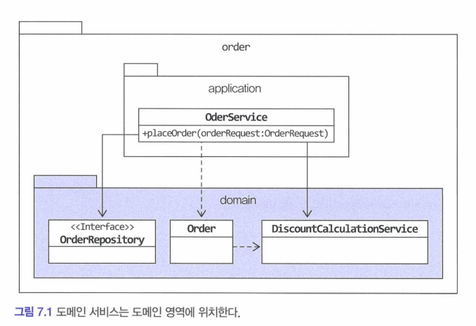
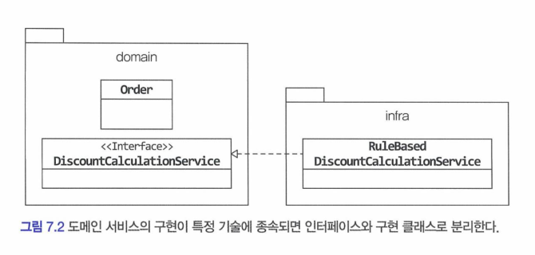

# Chapter 7. 도메인 서비스

---

<!-- TOC -->
* [Chapter 7. 도메인 서비스](#chapter-7-도메인-서비스)
  * [7.1 여러 애그리거트가 필요한 기능](#71-여러-애그리거트가-필요한-기능)
  * [7.2 도메인 서비스](#72-도메인-서비스)
    * [7.2.1 계산 로직과 도메인 서비스](#721-계산-로직과-도메인-서비스)
    * [7.2.2 외부 시스템 연동과 도메인 서비스](#722-외부-시스템-연동과-도메인-서비스)
    * [7.2.3 도메인 서비스의 패키지 위치](#723-도메인-서비스의-패키지-위치)
    * [7.2.4 도메인 서비스의 인터페이스와 클래스](#724-도메인-서비스의-인터페이스와-클래스)
<!-- TOC -->

---


## 7.1 여러 애그리거트가 필요한 기능

- 도메인 영역의 코드를 작성하다 보면, **한 애그리거트로 기능을 구현할 수 없을 때**가 있다.
    - 결제 금액 계산 로직
        - 상품 : 상품 가격, 배송비 확인
        - 주문 : 상품의 구매 개수
        - 할인 : 쿠폰 조건, 특정 상품 혹은 조건 필요
        - 회원 : 회원 등급에 따른 추가 할인
    - 어떤 애그리거트가 실제 결제 금액을 계산해야 하는가?
      —> 도메인 기능을 별도 서비스로 구현하는 것

---

## 7.2 도메인 서비스

도메인 서비스는 도메인 영역에 위치한 도메인 로직을 표현할 때 사용

- 계산 로직 : 여러 애그리거트가 필요한 계산 로직, 한 애그리거트에 넣기에는 다소 복잡한 계산 로직
- 외부 시스템 연동이 필요한 도메인 로직 : 구현하기 위해 타 시스템을 사용해야 하는 도메인 로직

### 7.2.1 계산 로직과 도메인 서비스

- 할인 금액 규칙 계산처럼 한 애그리거트에 넣기 애매한 도메인 개념을 도메인 서비스를 이용해서 구현
- 도메인 로직과 직접적으로 연관
- 사용 주체는 애그리거트가 될 수도 있고, 응용 서비스가 될 수도 있다.
    - 애그거트에 전달
        - 이 경우 응용 서비스는 애그리거트 객체에게 도메인 서비스를 전달하는 책임을 갖는다

    ```java
    public void calculateAmounts(
    		DiscountCalculationService disCalsvc, 
    		MemberGrade grade) {
    	// ...
    }
    ```

    ```java
    public class OrderService {
    	private DiscountCalculationService discountCalculationService;
    	// ...
    }
    ```

    - 도메인 서비스 객체에게 애그리거트를 전달
        - 계좌 이체가 대표적인 예

    ```java
    public class TransferService {
    	public void transfer(Account fromAcc, Account toAcc, Money money) {
    		// ...
    	}
    }
    ```


<aside>
💡 도메인 서비스 객체를 애그리거트에 주입하지 않는다.

- 도메인 객체의 필드로 구성된 데이터와 메서드를 이용해서 개념적으로 하나인 모델을 표현한다.
- 필드에 서비스가 있는 것은 도메인 모델 책임과는 전혀 관련이 없다.

```java
public class Order {
	@Autowired
	private DiscountCalculationService discountCalculationService;
	// ...
}
```

</aside>

<aside>
💡 응용 서비스 vs 도메인 서비스

- 애그리거트의 상태 변경, 애그리거트의 상태 값을 계산 —> 도메인 서비스
- 응용 서비스는 애그리거트 간, 혹은 애그리거트와 인프라 간 연결해주는 책임이 있다.
</aside>

### 7.2.2 외부 시스템 연동과 도메인 서비스

설문조사 시스템 구축

- 설문 조사 시스템과 사용자 역할 관리 시스템이 분리되어 있는 경우
- 설문 조사 시스템은 설문조사 생성 시 사용자의 생성 권한을 확인해야 한다면?
- 인프라 스트럭처 관점에서는 HTTP API 호출로 이루어질 수 있지만, 도메인 입장에서는 **사용자가 설문 조사 생성 권한을 가졌는지 확인하는 도메인 로직**으로 볼 수 있다.

```java
public interface SurveyPermissionChecker {
	boolean hasUserCreationPermission(String userId);
}

public class CreateSurveyService {
	private SurveyPermissionChecker permissionChecker;
	
	public Long createSurvey(CreateSurveyRequest req) {
		validate(req);
		// 도메인 서비스를 이용해서 외부 시스템 연동을 표현
		if(!permissionChecker.hasUserCreateionPermission(req.getRequestorId()) {
			throw new NoPermissionException();
		}
	// ...
}이 
```

- 이 때, SurveyPermissionChecker 인터페이스를 구현한 클래스는 인프라스트럭처 영역에 위채해 연동을 포함한 권한 검사 기능을 구현
  (Q : 인프라 스트럭처 영역에서 권한 검사 기능?)

### 7.2.3 도메인 서비스의 패키지 위치

- 도메인 서비스는 도메인 로직을 표현하므로, 다른 도메인 구성요소와 동일한 패키지에 위치
- 주문을 예로 들면?



- 도메인 서비스의 개수가 많아지거나, 앤티티나 밸류와 같은 다른 구성요소와 명시적으로 구분하고 싶다면 하위 패키지로 구분하여 위치
    - domain.model : 밸류
    - domain.service : 도메인 서비스
    - domain.repository : 엔티티의 repository

### 7.2.4 도메인 서비스의 인터페이스와 클래스

- 도메인 서비스의 로직이 고정되어 있지 않은 경우, 도메인 서비스 자체를 인터페이스로 구현하고 이를 구현한 클래스를 둘 수도 있다.
- 도메인 로직을 외부 시스템이나 별도 엔진을 이용해서 구현할 때 인터페이스와 클래스를 분리하게 된다.
  (특정 기술에 대한 의존성이 생길 경우, interface 로 정의)
    - 이렇게 하면, 특정 구현에 종속되는 것을 방지할 수 있고, 도메인 영역에 대한 테스트가 쉬워진다.



---